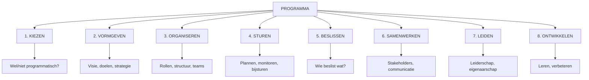

# Deel 1: Wat is een Programma?

> **Bron:** Werken aan Programma's (Björn Prevaas & Niels van Loon)
> **Thema:** 1 - KIEZEN (Hoofdstukken 1-6)
> **Toepassing:** Klant in Beeld (Cito)

---

## HOOFDSTUK 1: ESSENTIES EN ONTSTAAN VAN PROGRAMMAMANAGEMENT

### 1.1 Definitie van een Programma

> **"Een programma is een samenhangend geheel van inspanningen, gericht op het realiseren van baten in meerdere delen van de organisatie, waarin afhankelijkheden bestaan tussen inspanningen en waarin sturing nodig is op effecten in plaats van alleen output."**

### Kernkenmerken

| Kenmerk | Beschrijving |
|---------|--------------|
| **Batengericht** | Focus op effecten/outcomes, niet alleen deliverables |
| **Organisatiebreed** | Werkt over afdelings-/disciplinegrenzen heen |
| **Afhankelijkheden** | Inspanningen zijn onderling verbonden |
| **Langdurig** | Meestal meerdere jaren |
| **Strategisch** | Gericht op strategische doelstellingen |

### 1.2 Project vs. Programma

| Aspect | Project | Programma |
|--------|---------|-----------|
| **Focus** | Output/deliverable | Baten/effecten |
| **Duur** | Maanden | Jaren |
| **Scope** | Afgebakend | Meervoudig, evoluerend |
| **Sturing** | Op activiteiten | Op effecten |
| **Werkwijze** | Eén type | Mix van projecten, processen, leertrajecten |

### 1.3 Waarom Programma's Nu Relevant Zijn

- Grenzen tussen disciplines vervagen
- Opgaven worden complexer en holistischer
- Maatschappelijke en klantgerichte eisen stijgen
- Snelheid van verandering neemt toe
- Project-by-project aanpak levert onvoldoende duurzame effecten

---

## HOOFDSTUK 2: KIEZEN TUSSEN MANIEREN VAN WERKEN

### 2.1 Vijf Werkwijzen

```
┌─────────────────────────────────────────────────────────────────┐
│  WERKWIJZEN IN ORGANISATIES                                     │
├─────────────────────────────────────────────────────────────────┤
│                                                                 │
│  1. ROUTINES        → Telkens dezelfde stappen                  │
│     [Herhaling]       Voorspelbaar, efficiënt                   │
│                                                                 │
│  2. IMPROVISATIES   → Uitproberen en experimenteren             │
│     [Ontdekking]      Creatief, flexibel                        │
│                                                                 │
│  3. PROJECTEN       → Uniek, afgebakend product                 │
│     [Deliverable]     Duidelijke scope, planning                │
│                                                                 │
│  4. PROCESSEN       → Duurzame werkwijze                        │
│     [Uniformering]    Continu verbeterbaar                      │
│                                                                 │
│  5. PROGRAMMA'S     → Samenhangend geheel van inspanningen      │
│     [Batenrealisatie] Sturing op effecten, jaren                │
│                                                                 │
└─────────────────────────────────────────────────────────────────┘
```

### 2.2 Selectiecriteria

**De werkwijze moet aansluiten op de AARD VAN DE OPGAVE:**

1. Hoe bekend is de opgave?
2. Hoe complex is zij?
3. Hoe lang zal zij duren?
4. Hoeveel afdelingen/organisaties betrokken?
5. Hoe afhankelijk zijn de onderdelen?
6. Moet er duurzame verandering ontstaan?

---

## HOOFDSTUK 3: KENMERKEN VAN EN REDENEN VOOR PROGRAMMA'S

### 3.1 Zes Kernkenmerken

```
┌─────────────────────────────────────────────────────────────────┐
│  PROGRAMMA KENMERKEN                                            │
├─────────────────────────────────────────────────────────────────┤
│                                                                 │
│  ┌─────────────────┐  ┌─────────────────┐  ┌─────────────────┐  │
│  │ 1. MEERDERE     │  │ 2. MEERDERE     │  │ 3. AFHANKELIJK- │  │
│  │    BATEN        │  │    INSPANNINGEN │  │    HEDEN        │  │
│  │                 │  │                 │  │                 │  │
│  │ Doelen in       │  │ Projecten +     │  │ Volgorde en     │  │
│  │ meerdere        │  │ Processen +     │  │ samenhang       │  │
│  │ domeinen        │  │ Leertrajecten   │  │ kritisch        │  │
│  └─────────────────┘  └─────────────────┘  └─────────────────┘  │
│                                                                 │
│  ┌─────────────────┐  ┌─────────────────┐  ┌─────────────────┐  │
│  │ 4. STURING OP   │  │ 5. MEERJARIG    │  │ 6. ORGANISATIE- │  │
│  │    EFFECTEN     │  │    STRATEGISCH  │  │    OVERSTIJGEND │  │
│  │                 │  │                 │  │                 │  │
│  │ Niet alleen     │  │ Jaren, niet     │  │ Over afdelingen │  │
│  │ output/         │  │ maanden         │  │ en organisaties │  │
│  │ activiteiten    │  │                 │  │ heen            │  │
│  └─────────────────┘  └─────────────────┘  └─────────────────┘  │
│                                                                 │
└─────────────────────────────────────────────────────────────────┘
```

### 3.2 Checklist: Is Programmasturing Nodig?

- [ ] Is de opgave strategisch en organisatiebreed?
- [ ] Zijn er meerdere afhankelijkheden tussen inspanningen?
- [ ] Duurt dit jaren en niet maanden?
- [ ] Zijn er meerdere soorten inspanningen nodig?
- [ ] Is sturing op BATEN en EFFECTEN kritisch?
- [ ] Zijn meerdere afdelingen/organisaties betrokken?

**Zo ja → Programmasturing inzetten**

### 3.3 Veelvoorkomende Misverstanden

| Misverstand | Waarheid |
|-------------|----------|
| "Programma = groot project" | Programma is ander TYPE sturing, niet alleen schaal |
| "Alleen voor grote organisaties" | Gaat om aard van opgave, niet organisatiegrootte |
| "Programma's zijn rigide" | Moderne programma's zijn adaptief |
| "Alleen voor IT/techniek" | Kunnen in elk domein ingezet worden |

---

## HOOFDSTUK 4: PRINCIPES ONDER DE PROGRAMMA-AANPAK

### De 8 Kernprincipes

```
╔═══════════════════════════════════════════════════════════════════╗
║  8 PRINCIPES PROGRAMMAMANAGEMENT                                  ║
╠═══════════════════════════════════════════════════════════════════╣
║                                                                   ║
║  1. STUREN VANUIT VISIE EN DOELEN                                 ║
║     > boven sturen op inspanningen                                ║
║     Focus op DOEL en EFFECT, niet op activiteiten/output          ║
║                                                                   ║
║  2. EIGENAARSCHAP AANBOREN                                        ║
║     > boven opdrachten geven                                      ║
║     Mensen nemen ownership van doelen die zij begrijpen           ║
║                                                                   ║
║  3. BELANGEN VERBINDEN                                            ║
║     > boven belangen vertegenwoordigen                            ║
║     Zoek gemeenschappelijke doelen, niet afdelingsgrenzen         ║
║                                                                   ║
║  4. EXPLICIET MAKEN                                               ║
║     > boven impliciet laten                                       ║
║     Zeg hardop wat je doet en waarom                              ║
║                                                                   ║
║  5. BALANS LEREN EN PRESTEREN                                     ║
║     > boven alleen presteren                                      ║
║     Maak tijd voor reflectie, niet alleen voor "afmaken"          ║
║                                                                   ║
║  6. INTEGRITEIT BESLUITVORMING                                    ║
║     > boven inhoud van besluiten                                  ║
║     HOE je besluiten neemt is minstens zo belangrijk              ║
║                                                                   ║
║  7. WERKEN MET DOEL VOOR OGEN                                     ║
║     > boven programma in stand houden                             ║
║     Programma is middel, niet doel                                ║
║                                                                   ║
╚═══════════════════════════════════════════════════════════════════╝
```

---

## HOOFDSTUK 5: THEMA'S IN EEN PROGRAMMA

### De 8 Thema's



| Thema | Centrale Vraag | Output |
|-------|----------------|--------|
| **1. KIEZEN** | Wel/niet programmatisch? | Programmavoorstel, Go/No-go |
| **2. VORMGEVEN** | Hoe ziet het eruit? | Programmaplan, visie, routekaart |
| **3. ORGANISEREN** | Wie doet wat? | Organigram, rollen, teams |
| **4. STUREN** | Hoe op koers houden? | Dashboard, rapportages |
| **5. BESLISSEN** | Wie beslist wat? | Besluitvormingsstructuur |
| **6. SAMENWERKEN** | Hoe werken we samen? | Stakeholder map, communicatieplan |
| **7. LEIDEN** | Hoe leiderschap inzetten? | Leiderschapscultuur |
| **8. ONTWIKKELEN** | Hoe leren we? | Leerplan, reflectiemomenten |

---

## HOOFDSTUK 6: LEVENSLOOP VAN EEN PROGRAMMA

### De 4 Fasen

```
┌─────────────────────────────────────────────────────────────────────────┐
│  LEVENSLOOP PROGRAMMA                                                   │
├─────────────────────────────────────────────────────────────────────────┤
│                                                                         │
│   ┌──────────┐   ┌──────────┐   ┌──────────┐   ┌──────────┐            │
│   │          │   │          │   │          │   │          │            │
│   │ VERKENNEN│──▶│ OPBOUWEN │──▶│ UITVOEREN│──▶│ AFBOUWEN │            │
│   │          │   │          │   │          │   │          │            │
│   └──────────┘   └──────────┘   └──────────┘   └──────────┘            │
│                                                                         │
│   Weken-mnd      Maanden        Jaren          Maanden                  │
│                                                                         │
│   • Opgave       • Programma-   • Cycli        • Evaluatie              │
│     verkennen      plan         • Monitor      • Overdracht             │
│   • Besluit      • Business     • Bijstuur     • Borging                │
│     Go/No-go       case         • Reflectie    • Sluiting               │
│                  • Organisatie                                          │
│                                                                         │
└─────────────────────────────────────────────────────────────────────────┘
```

### Per Fase

| Fase | Duur | Centrale Vraag | Output |
|------|------|----------------|--------|
| **VERKENNEN** | Weken-maanden | Is dit echt een programma? | Programmavoorstel, Go/No-go |
| **OPBOUWEN** | Maanden | Hoe gaan we dit doen? | Programmaplan, Business case |
| **UITVOEREN** | Jaren | Hoe houden we koers? | Voortgangsrapportages, bijstellingen |
| **AFBOUWEN** | Maanden | Zijn baten bereikt? | Evaluatie, overdracht, sluiting |

---

## TOEPASSING OP KLANT IN BEELD (CITO)

### Is Klant in Beeld een Programma? **JA**

```
╔═══════════════════════════════════════════════════════════════════╗
║  KLANT IN BEELD VOLDOET AAN ALLE PROGRAMMA-CRITERIA               ║
╠═══════════════════════════════════════════════════════════════════╣
║                                                                   ║
║  ✓ MEERDERE BATEN                                                 ║
║    • Klantgerichtheid (cultuur)                                   ║
║    • Betere klantrelaties (operationeel)                          ║
║    • Efficiëntere samenwerking (proces)                           ║
║    • Integraal klantbeeld (systeem)                               ║
║    • Betere datakwaliteit (technisch)                             ║
║                                                                   ║
║  ✓ MEERDERE ORGANISATIEONDERDELEN                                 ║
║    • PO, VO, Zakelijk/Professionals                               ║
║    • Klantcontact, SIO, HR                                        ║
║    • Data & Tech, Management                                      ║
║                                                                   ║
║  ✓ MEERDERE SOORTEN INSPANNINGEN                                  ║
║    • Projecten: Herontwerp klantreizen, CRM                       ║
║    • Processen: Uniform klantproces                               ║
║    • Leertrajecten: Outside-in vaardigheden                       ║
║    • Systeemveranderingen: Datakwaliteit, integraties             ║
║                                                                   ║
║  ✓ AFHANKELIJKHEDEN                                               ║
║    • Systeem ondersteunt proces                                   ║
║    • Proces vraagt gedragsverandering                             ║
║    • Gedrag verankerd in cultuur                                  ║
║                                                                   ║
║  ✓ MEERJARIG EN STRATEGISCH                                       ║
║    • 2-4 jaar doorlooptijd                                        ║
║    • Gekoppeld aan Cito-strategie                                 ║
║                                                                   ║
╚═══════════════════════════════════════════════════════════════════╝
```

### Huidige Fase: VERKENNING → OPBOUW

```
┌─────────────────────────────────────────────────────────────────────────┐
│  KLANT IN BEELD - HUIDIGE POSITIE                                       │
├─────────────────────────────────────────────────────────────────────────┤
│                                                                         │
│   ┌──────────┐   ┌──────────┐   ┌──────────┐   ┌──────────┐            │
│   │          │   │          │   │          │   │          │            │
│   │ VERKENNEN│──▶│ OPBOUWEN │   │ UITVOEREN│   │ AFBOUWEN │            │
│   │    ✓     │   │  ← HIER  │   │          │   │          │            │
│   └──────────┘   └──────────┘   └──────────┘   └──────────┘            │
│                       ▲                                                 │
│                       │                                                 │
│                  GO-BESLUIT MT                                          │
│                                                                         │
└─────────────────────────────────────────────────────────────────────────┘
```

### Kritieke Succesfactoren voor Klant in Beeld

| Factor | Hoe toe te passen |
|--------|-------------------|
| **Eigenaarschap baateigenaren** | Sectormanagers bepalen zelf welke baten kritiek zijn |
| **Sturing op baten** | Dashboard toont effecten, niet alleen activiteiten |
| **Belangen verbinden** | Coalitie rond gemeenschappelijk doel: klantgerichtheid |
| **Expliciet maken** | Heldere definitie "klantgerichtheid" per sector |
| **Balans leren/presteren** | Tijd voor retrospectives, pilots voor full-scale |

---

## PRAKTISCHE CHECKLIST

### Baten per Domein Definiëren

| Domein | Vraag | Te meten |
|--------|-------|----------|
| **MENS** | Kunnen medewerkers outside-in werken? | Vaardigheidsniveau, gedragsobservaties |
| **PROCES** | Is er uniform klantproces? | Processtatus, naleving |
| **SYSTEEM** | Is er 360° klantbeeld? | Datakwaliteit, systeemintegratie |
| **CULTUUR** | Is klantgericht werken de norm? | Cultuurmeting, gedragsindicatoren |

### Afhankelijkheden Identificeren

```
[ ] Data-integratie NODIG VOOR uniform klantproces
[ ] Training NODIG VOOR procesuitvoering
[ ] Cultuurverandering NODIG VOOR vasthouden van proces
[ ] Procesformalisatie NODIG VOOR systeemontwerp
[ ] CRM-mogelijkheden NODIG VOOR proces uit te voeren
[ ] Rolverdeling NODIG VOOR eenduidig contact
```

---

*Gegenereerd: 10 januari 2026*
*Fase 1 - Theorie Deel 1 afgerond*
