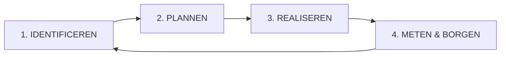
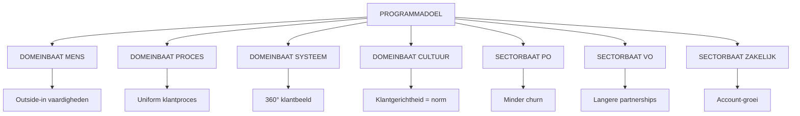
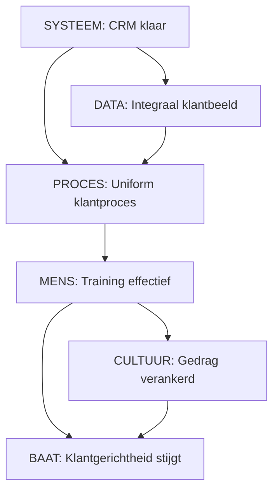

# Deel 2: Baten en Effectstructuur

> **Bron:** Werken aan Programma's (Björn Prevaas & Niels van Loon)
> **Thema:** 2 - VORMGEVEN (Hoofdstukken 7-10)
> **Toepassing:** Klant in Beeld (Cito)

---

## HOOFDSTUK 7: EEN GEDRAGEN VISIE CREËREN

### Doel & Betekenis

Een gedragen visie is de gezamenlijke toekomstafbeelding waarnaar het programma werkt:
- Geeft richting aan alle inspanningen
- Aanblindt eigenaarschap bij medewerkers
- Verbindt belangen (in plaats van verdelen)

### Klant in Beeld - Doelbeeld

> "Het programma Klant in Beeld ondersteunt Cito om zich duurzaam te ontwikkelen tot een organisatie die **vanuit een outside-in perspectief werkt**, waarin **mens, proces en systeem met elkaar verbonden zijn** en deze samenhang **onderdeel wordt van de cultuur**, zodat dienstverlening en samenwerking **blijvend aansluiten bij de behoeften, verwachtingen en contexten van klanten**."

**Kernconcepten:**
- **Outside-in perspectief**: Situatie van klanten is leidend
- **Verbinding Mens-Proces-Systeem**: Gedrag, werkwijze en systemen versterken elkaar
- **Cultuurverankering**: Klantgericht werken is geen project, maar manier van werken
- **Duurzame aansluiting**: Voortdurende focus op wat klanten nodig hebben

---

## HOOFDSTUK 8: DOELEN EN BATEN IDENTIFICEREN

### 8.1 Batenmanagement

#### Definitie

> **Baten = de gewenste effecten die een programma moet realiseren.**

**Baten zijn NIET:**
- Output (deliverables, werkproducten)
- Activiteiten (wat we doen)
- Projectresultaten (tussenresultaten)

**Voorbeeld:**
| Aspect | Output | Baat |
|--------|--------|------|
| CRM | "CRM-systeem geïmplementeerd" | "360-graden klantbeeld beschikbaar, waardoor accountmanagers proactief kunnen handelen" |

#### Baten op Verschillende Niveaus

```
┌─────────────────────────────────────────────────────────────────────┐
│  BATENNIVEAUS                                                       │
├─────────────────────────────────────────────────────────────────────┤
│                                                                     │
│  PROGRAMMABATEN (overkoepelend)                                     │
│  └─ "Cito werkt outside-in, mens-proces-systeem verbonden"          │
│                                                                     │
│  DOMEINBATEN (per veranderdomein)                                   │
│  ├─ MENS: Teams kunnen outside-in werken                            │
│  ├─ PROCES: Uniform klantproces                                     │
│  ├─ SYSTEEM: Integraal klantbeeld                                   │
│  └─ CULTUUR: Klantgericht is norm                                   │
│                                                                     │
│  SECTORBATEN (per bedrijfsonderdeel)                                │
│  ├─ PO: Minder ongewenste uitstroom                                 │
│  ├─ VO: Duurzame partnerrelaties                                    │
│  └─ ZAKELIJK: Versterkte samenwerking                               │
│                                                                     │
│  INSPANNINGSBATEN (directe output)                                  │
│  └─ CRM verbeterd, proces ontworpen, teams getraind                 │
│                                                                     │
└─────────────────────────────────────────────────────────────────────┘
```

---

### 8.2 Het Batenmanagementproces



| Fase | Activiteiten | Output |
|------|--------------|--------|
| **1. IDENTIFICEREN** | Gap-analyse, stakeholderanalyse, doelstelling | Batenkaart |
| **2. PLANNEN** | Inspanningen bepalen, afhankelijkheden, fasering | Inspanningsplan |
| **3. REALISEREN** | Uitvoeren, monitoren, bijsturen | Voortgangsrapportages |
| **4. METEN & BORGEN** | Effect meten, duurzaamheid, overdracht | Evaluatie |

---

### 8.3 Doelen vs Baten

| Aspect | Doelen | Baten |
|--------|--------|-------|
| **Wat** | Gewenste toestand / richting | Werkelijk bereikte effecten |
| **Formulering** | Vaak breder, inspirerend | Concreet, meetbaar, toetsbaar |
| **Voorbeeld** | "Klantgerichter werken" | "Klantfeedback-score stijgt van 6.2 naar 7.5" |

#### Drie Soorten Baten

| Type | Focus | Klant in Beeld Voorbeeld |
|------|-------|-------------------------|
| **STRATEGISCH** | Omzet, marktpositie, reputatie | Hogere klantretentie → minder churn |
| **OPERATIONEEL** | Proces, snelheid, kwaliteit | Eenduidige klanthantering |
| **TRANSFORMATIONEEL** | Cultuur, gedrag, competenties | Teams denken outside-in |

---

### 8.4 Instrumenten voor Identificatie

#### Instrument 1: GAP-ANALYSE

```
┌────────────────────────────────────────────────────────────────────┐
│  GAP-ANALYSE KLANT IN BEELD                                        │
├─────────┬─────────────────────────┬─────────────────────┬──────────┤
│ DOMEIN  │ IS (NU)                 │ TOEKOMST            │ GAP      │
├─────────┼─────────────────────────┼─────────────────────┼──────────┤
│ MENS    │ Geen structurele        │ Alle teams 2x/jaar  │ Training │
│         │ training; terugval      │ training; coaching  │ infra    │
├─────────┼─────────────────────────┼─────────────────────┼──────────┤
│ PROCES  │ PO/VO/Zakelijk alle     │ 1 gestandaardiseerd │ Proces-  │
│         │ eigen werkwijzen        │ klantproces         │ ontwerp  │
├─────────┼─────────────────────────┼─────────────────────┼──────────┤
│ SYSTEEM │ Klantdata in 5          │ 1 integraal systeem │ CRM +    │
│         │ verschillende systemen  │ 360° klantbeeld     │ integr.  │
├─────────┼─────────────────────────┼─────────────────────┼──────────┤
│ CULTUUR │ "Wij doen wat wij       │ "We luisteren naar  │ Leader-  │
│         │ doen, klant past aan"   │ klanten"            │ ship     │
└─────────┴─────────────────────────┴─────────────────────┴──────────┘
```

#### Instrument 2: STAKEHOLDER-ANALYSE

| Stakeholder | Belang | Gewenste Baten |
|-------------|--------|----------------|
| **Sectormanager PO** | Klantretentie | Daling ongewenste uitstroom |
| **Sectormanager VO** | Duurzame partnerships | Langere relaties |
| **Sectormanager Zakelijk** | Groei & engagement | Meer adviesvolume |
| **Manager Data & Tech** | Betrouwbare data | Integraal klantbeeld |
| **Medewerkers** | Duidelijkheid | Begeleiding, feedback |
| **Klanten (extern)** | Consistent & responsief | Beter begrepen, sneller geholpen |

#### Instrument 3: BATENSTRUCTUUR



#### Instrument 4: EFFECTPAD (Logic Model)

```
INSPANNING    →    OUTPUT         →    OUTCOME        →    IMPACT
────────────────────────────────────────────────────────────────────

Training      →   Medewerkers    →   Nieuw gedrag    →    Klanten
"outside-in"      gecertificeerd     in klantcontact      merken verschil

CRM-verbetering → Systeem bevat  → Accountmanagers  →    Proactieve
                  360° beeld       zien klantbehoefte    dienstverlening

Uniform proces → Werkstroom      → Geen verlies     →    Klanten
                 standaard         van informatie        ervaren consistentie
```

---

### 8.5 Baten Formuleren

#### SMART Criteria

| Letter | Betekenis | Voorbeeld Klant in Beeld |
|--------|-----------|--------------------------|
| **S** | Specifiek | "Klantretentie PO verhogen" |
| **M** | Meetbaar | "Van 75% naar 85%" |
| **A** | Actiebaar | "Via training + proces + CRM" |
| **R** | Realistisch | "Binnen 18 maanden" |
| **T** | Tijdsgebonden | "Deadline: Q2 2027" |

#### Voorbeelden Goed vs Slecht

| SLECHT | GOED |
|--------|------|
| "Betere klantrelaties" | "Klantretentie-score stijgt van 75% naar 85% binnen 18 maanden" |
| "Teams leren outside-in" | "85% van contactmedewerkers slaagt voor outside-in certificering" |
| "Systemen verbeteren" | "CRM-adoptie stijgt van 60% naar 95%; datakwaliteit van 7.2 naar 8.5" |
| "Cultuurverandering" | "Eigenaarschapsmeting stijgt van 5.2 naar 7.0" |

---

### 8.6 Aandachtspunten bij Batenwerk

| Aandachtspunt | Risico | Remedie |
|---------------|--------|---------|
| **Baten vs Output verwisselen** | "Training gegeven = baat gerealiseerd" | Meetpunten inbouwen: na 2 weken, 2 maanden, 6 maanden |
| **Baten die tegenwerken** | Snelheid kan botsen met diepte | Expliciet bespreken, prioriteren |
| **Moeilijke baten (cultuur)** | Moeilijk te meten, duurt lang | Splits in deelbaten, voortgangsindicatoren |
| **Quick wins vs fundamenteel** | Quick wins bereikt, niets echt veranderd | Prioriteer BEIDE |
| **Overbelasting** | Alle baten bereiken → burn-out | Realistisch begroten, fasen |
| **Meten zonder actie** | Data verzameld, niets mee gedaan | Regelmatige reviewcyclus |

---

## HOOFDSTUK 9: DE (VERANDER)STRATEGIE

### Kernvragen

1. Welke **inspanningstypes** zijn nodig?
2. In welke **volgorde** (afhankelijkheden)?
3. Welke strategie voor **weerstand**?
4. Welke **middelen** nodig?
5. Wat zijn **risico's**?

### 4 Inspanningstypes Klant in Beeld

| Type | Doel | Voorbeelden |
|------|------|-------------|
| **PROJECTEN** | Afgebakend resultaat | Herontwerp klantreizen, CRM-implementatie |
| **PROCESSEN** | Duurzame werkwijze | Uniform klantproces |
| **LEERTRAJECTEN** | Vaardigheden & gedrag | Outside-in training, coaching |
| **SYSTEEMWERK** | Technische ondersteuning | CRM-verbetering, datamodel |

---

## HOOFDSTUK 10: VERMOGENS

### Soorten Vermogens

```
┌─────────────────────────────────────────────────────────────────────┐
│  6 SOORTEN VERMOGENS                                                │
├─────────────────────────────────────────────────────────────────────┤
│                                                                     │
│  1. ORGANISATORISCH   │ Structuur, rollen, bevoegdheden             │
│  2. INHOUDELIJK       │ Kennis, expertise, tools                    │
│  3. MENSELIJK         │ Competenties, capaciteit, draagvlak         │
│  4. FINANCIEEL        │ Budget, investeringen, ROI                  │
│  5. TECHNISCH         │ Systemen, integraties, data                 │
│  6. CULTUREEL         │ Bereidwilligheid, eigenaarschap, leren      │
│                                                                     │
└─────────────────────────────────────────────────────────────────────┘
```

### Gaten in Vermogens - Klant in Beeld

| Vermogen | GAP | Oplossing |
|----------|-----|-----------|
| **Organisatorisch** | Geen helder programmamanagement | Inrichten programmaraad |
| **Inhoudelijk** | Onvoldoende procesexpertise | 3Sides (extern) + intern leren |
| **Menselijk** | Baateigenaren niet gewend aan "baten sturen" | Training baateigenaren |
| **Financieel** | Geen duidelijke begroting | Businesscase met middelenplan |
| **Technisch** | CRM onvoldoende, data versnipperd | CRM-project, data-integratie |
| **Cultureel** | Afwachtende cultuur | Leadershipontwikkeling |

---

## TOEPASSING OP KLANT IN BEELD

### Baatenkader per Sector

#### SECTOR: PRIMAIR ONDERWIJS (PO)

| Domein | Kernprobleem | Gewenste BAAT | Indicator |
|--------|--------------|---------------|-----------|
| **MENS** | Teams niet geschoold | Outside-in toepassen | % certificering, gedragsobservatie |
| **PROCES** | Eigen werkwijzen | Uniform klantproces | Procesnaleving %, cyclustijd |
| **SYSTEEM** | CRM niet gebruikt | 360° klanthistorie | CRM-adoptie, datavolledigheid |
| **CULTUUR** | Afwachtend | Eigenaarschap klantbegrip | Eigenaarschapsmeting |
| **SECTORBAAT** | 12% churn | Daling naar 8% | NPS-score, churn-rate |

#### SECTOR: VOORTGEZET ONDERWIJS (VO)

| Domein | Kernprobleem | Gewenste BAAT | Indicator |
|--------|--------------|---------------|-----------|
| **MENS** | Veel data, weinig duiding | Klanttrends analyseren | Analysecapaciteit |
| **PROCES** | Advies ongestructureerd | Helder adviesproces | Afsluitingsrate |
| **SYSTEEM** | Klantbehoefte niet transparant | Klantbehoefte VOOR gesprek zien | CRM-voorbereiding |
| **CULTUUR** | Reactief | Proactief outreach | Initiatieftijd |
| **SECTORBAAT** | Klanten zoeken alternatief | +30% relatie-duur | NPS, herkooppercentage |

#### SECTOR: ZAKELIJK/PROFESSIONALS

| Domein | Kernprobleem | Gewenste BAAT | Indicator |
|--------|--------------|---------------|-----------|
| **MENS** | Niet gelijk met klantbehoefte | Behoeftenonderzoek uitvoeren | Onderzoeksfrequentie |
| **PROCES** | Relatie-onderhoud slecht | Klantreview elk halfjaar | Reviewnaleving % |
| **SYSTEEM** | Handmatig beheer | Dashboard met risico's/kansen | Dashboard-adoptie |
| **CULTUUR** | Korte termijn denken | Account-eigenaren voorkomen churn | Proactieve interventies |
| **SECTORBAAT** | Account-waarde fluctueert | +15% ARR-groei | Customer-lifetime-value |

---

### Integrale Batenstructuur

```
PROGRAMMA-DOEL: Cito wordt outside-in organisatie
│
├─ DOMEINBAAT MENS
│  └─ Outside-in werkende teams
│     ├─ Training "outside-in denken"
│     ├─ Coaching-on-the-job
│     └─ Intervisiegroepen
│
├─ DOMEINBAAT PROCES
│  ├─ PO: Uniform klantproces
│  ├─ VO: Uniform adviesproces
│  └─ Zakelijk: Uniform accountmanagement
│
├─ DOMEINBAAT SYSTEEM
│  └─ Integraal klantbeeld
│     ├─ CRM-verbetering
│     ├─ Data-integratie
│     └─ Dashboard-ontwikkeling
│
├─ DOMEINBAAT CULTUUR
│  └─ Klantgericht als norm
│     ├─ Leadershipontwikkeling
│     └─ Succesgedeelde
│
├─ SECTORBAAT PO: Churn 12% → 8%
├─ SECTORBAAT VO: Relatie-duur +30%
└─ SECTORBAAT ZAKELIJK: ARR +15%
```

---

### Afhankelijkheden



---

### Template: Batenuitwerking

```
┌────────────────────────────────────────────────────────────────────┐
│  BATENKAART - [SECTOR] - [DOMEIN]                                  │
├────────────────────────────────────────────────────────────────────┤
│                                                                    │
│  EIGENAAR:        [Naam]                                           │
│  DUUR:            [Periode]                                        │
│                                                                    │
│  KERNPROBLEEM:                                                     │
│  [Beschrijving huidige situatie]                                   │
│                                                                    │
│  GEWENSTE BAAT:                                                    │
│  "[SMART geformuleerde baat]"                                      │
│                                                                    │
│  MEETDOELEN:                                                       │
│  ├─ [Indicator 1]: [Van X naar Y] ([Deadline])                     │
│  ├─ [Indicator 2]: [Van X naar Y] ([Deadline])                     │
│  └─ [Indicator 3]: [Van X naar Y] ([Deadline])                     │
│                                                                    │
│  INSPANNINGEN:                                                     │
│  ├─ [Inspanning 1]: [Beschrijving] - Leider: [Naam]               │
│  ├─ [Inspanning 2]: [Beschrijving] - Leider: [Naam]               │
│  └─ [Inspanning 3]: [Beschrijving] - Leider: [Naam]               │
│                                                                    │
│  AFHANKELIJKHEDEN:                                                 │
│  ├─ [Domein X moet klaar zijn voor...]                             │
│  └─ [Domein Y moet leveren...]                                     │
│                                                                    │
│  RISICO'S & MITIGATIE:                                             │
│  ├─ [Risico 1] → [Mitigatie]                                       │
│  └─ [Risico 2] → [Mitigatie]                                       │
│                                                                    │
│  BUDGET: [EUR]                                                     │
│                                                                    │
└────────────────────────────────────────────────────────────────────┘
```

---

## SAMENVATTING DEEL 2

| Kernpunt | Toelichting |
|----------|-------------|
| **Baten zijn centraal** | Niet output, maar effecten |
| **4 niveaus** | Programma, domein, sector, inspanning |
| **SMART formuleren** | Specifiek, meetbaar, haalbaar |
| **Eigenaarschap** | Baateigenaren sturen op effect |
| **12 baatencellen** | 3 sectoren × 4 domeinen |
| **Plus programmabaat** | Overkoepelend: outside-in organisatie |

---

*Gegenereerd: 10 januari 2026*
*Fase 1 - Theorie Deel 2 afgerond*
