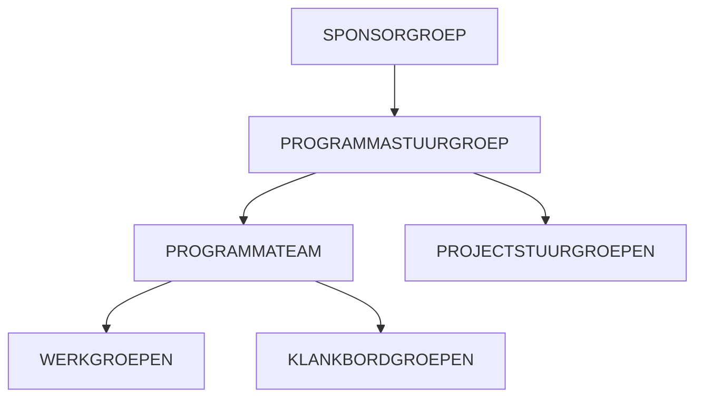
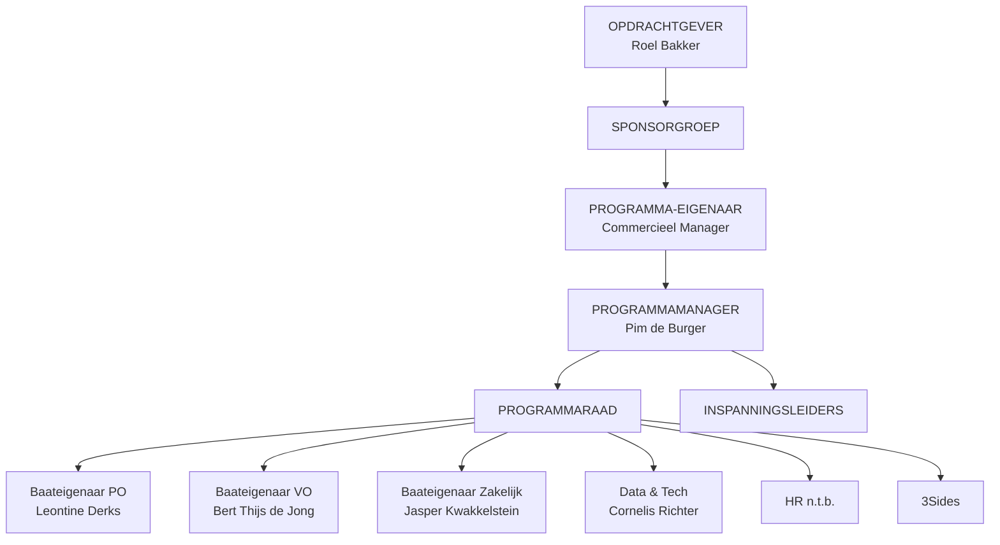

# Deel 3: Governance en Rollen

> **Bron:** Werken aan Programma's (Björn Prevaas & Niels van Loon)
> **Thema:** 3 - ORGANISEREN (Hoofdstukken 12-15)
> **Toepassing:** Klant in Beeld (Cito)

---

## HOOFDSTUK 12: ROLLEN DEFINIËREN EN VERDELEN

### 12.1 Groepen en Teams

**Onderscheid rollen vs. functies:**
- **Rol**: Tijdelijke positie voor een specifieke opgave (programma-eigenaar, programmamanager)
- **Functie**: Vaste positie in organisatie (directeur, manager)

> **Kernprincipe**: Mensen hebben meestal 1 functie maar kunnen meerdere rollen vervullen

---

### 12.2 SPONSORGROEP

**Definitie:** Strategische beslissers die bepalen dat opgave prioriteit krijgt

**Verantwoordelijkheden:**
1. Zorgt dat programma aansluit op organisatiedoelen
2. Bevordert commitment en steun
3. Lost conflicten met andere opgaven (portfolio) op
4. Stelt programma-eigenaar aan
5. Neemt strategische beslissingen buiten mandaat eigenaar
6. Weegt risico's af
7. Sluit programma formeel af

**Betrokkenheid:** Na start meestal passief; bij stadia-overgangen, grote oplevermomenten

---

### 12.3 PROGRAMMASTUURGROEP

De "leidende coalitie" die strategisch sturing geeft aan het programma.

#### A. PROGRAMMA-EIGENAAR

```
┌─────────────────────────────────────────────────────────────────────┐
│  PROGRAMMA-EIGENAAR                                                 │
├─────────────────────────────────────────────────────────────────────┤
│                                                                     │
│  VERANTWOORDELIJKHEDEN:                                             │
│  • Eindverantwoordelijk voor programma en realisering visie         │
│  • Zorgt voor middelen, strategische beslissingen, condities        │
│  • Scharnierpunt tussen programma en lijnorganisatie               │
│  • Voorzitter van de stuurgroep                                     │
│  • Legt verantwoording af aan sponsorgroep                          │
│  • Draagt bij aan prioritering in portfolio                         │
│                                                                     │
│  KERNBEVOEGDHEDEN:                                                  │
│  • Integreert belangen en maakt afwegingen                          │
│  • Vertegenwoordigt belang van organisatie als geheel              │
│  • Ziet toe dat alle belangen expliciet verdeeld zijn              │
│                                                                     │
│  WAARSCHUWING: NIET klaar na opdracht geven - betrokkenheid nodig! │
│                                                                     │
│  OOK BEKEND ALS: Opdrachtgever, Senior Responsible Owner           │
│                                                                     │
└─────────────────────────────────────────────────────────────────────┘
```

#### B. PROGRAMMAMANAGER

```
┌─────────────────────────────────────────────────────────────────────┐
│  PROGRAMMAMANAGER                                                   │
├─────────────────────────────────────────────────────────────────────┤
│                                                                     │
│  VERANTWOORDELIJKHEDEN:                                             │
│  • Dagelijkse leiding over het programma                            │
│  • Zorgt voor: vormgeving, monitoring, sturing, besluitvorming     │
│  • "Spin in het web" - aanspreekpunt tussen alle betrokkenen       │
│  • Zorgt dat samenwerking soepel verloopt                           │
│  • Ondersteunt bateneigenaren bij batenrealisatie                   │
│  • Legt verantwoording af aan programma-eigenaar                    │
│                                                                     │
│  KRITIEKE TAAK:                                                     │
│  Programma voortdurend afstemmen op verwachtingen baateigenaren    │
│                                                                     │
└─────────────────────────────────────────────────────────────────────┘
```

#### C. BATENEIGENAAR(EN)

```
┌─────────────────────────────────────────────────────────────────────┐
│  BATENEIGENAAR                                                      │
├─────────────────────────────────────────────────────────────────────┤
│                                                                     │
│  VERANTWOORDELIJKHEDEN:                                             │
│  • Verantwoordelijk voor realisering bepaalde baten/effecten        │
│  • Bepaalt samen met PM strategie en aanpak                         │
│  • Realiseert verandering binnen eigen organisatieonderdeel        │
│  • Kan opdrachtgever zijn voor bepaalde inspanningen               │
│  • Legt verantwoording af over batenrealisatie                      │
│                                                                     │
│  TYPE PERSOON: Meestal manager in staande organisatie              │
│                                                                     │
│  BELANGRIJK: Hebben hulp van programma nodig!                       │
│                                                                     │
│  OOK BEKEND ALS: Effecteigenaar, Business Change Manager           │
│                                                                     │
└─────────────────────────────────────────────────────────────────────┘
```

---

### 12.4 PROGRAMMATEAM

**Samenstelling onder leiding van programmamanager:**

| Rol | Verantwoordelijkheid |
|-----|---------------------|
| **Inspanningsleider** | Verbindende rol tussen programma en specifieke inspanning |
| **Ontwerper(s)** | Maakt strategie en ontwerp voor programma |
| **Communicatiemanager** | Ontwikkelt relaties met stakeholders |
| **Programmaondersteuner** | Secretarieel en procesmatig (PMO'er) |

#### Ontwerper - Twee Specialisaties

1. **Technisch ontwerper** (architect)
   - Technisch-inhoudelijke kant
   - Zorgt voor integratie en standaarden

2. **Verandermanager/Veranderstrateeg**
   - Veranderkundige kant
   - Plant interventies

---

### 12.5-12.7 Overige Rollen

| Groep | Rol |
|-------|-----|
| **Projectstuurgroep** | Sturing op projectniveau (opdrachtgever, senior gebruiker, senior leverancier) |
| **Inspanningsteam** | Leider + medewerkers die uitvoeren |
| **Veranderteam** | Ondersteunt bateneigenaar bij realisering |
| **Operatie** | Teams waar veranderingen plaatsvinden |

---

## HOOFDSTUK 13: DE ORGANISATIEVORM BEPALEN

### Vier Grondvormen

```
┌─────────────────────────────────────────────────────────────────────┐
│  GRONDVORMEN PROGRAMMAORGANISATIE                                   │
├─────────────────────────────────────────────────────────────────────┤
│                                                                     │
│  INVLOED PM:    VORMGEVING ←───────────────────→ UITVOERING        │
│                                                                     │
│  1. COÖRDINATIE    [==]                              [ ]            │
│     Beperkt op vormgeving, zeer beperkt op uitvoering              │
│     PM zorgt voor overzicht, monitoring, afstemming                │
│                                                                     │
│  2. REGIE          [====]                            [==]           │
│     Meer op vormgeving, minder op uitvoering                       │
│     Focus op gewenste richting                                     │
│                                                                     │
│  3. REALISATIE     [===]                             [====]         │
│     Meer op uitvoering, minder op vormgeving                       │
│     PM verantwoordelijk voor aansturing inspanningen               │
│                                                                     │
│  4. DIRECTIE       [======]                          [======]       │
│     VEEL op beide vormgeving EN uitvoering                         │
│     Alleen in bijzondere situaties                                 │
│                                                                     │
└─────────────────────────────────────────────────────────────────────┘
```

### Keuzesfactoren

1. **Vertrouwen** in programmamanager en team
2. **Persoon** van de programmamanager (vaardigheden, stijl)
3. **Programmastadium** (kan veranderen over tijd)
4. **Cultuur** betrokken organisatie(s)

**Praktijk:** Vaak "iets meer richting coördinatie of regie"

---

## HOOFDSTUK 14: OVERLEGGEN INRICHTEN

### Overlegstructuur



### Overlegtypen

| Overleg | Frequentie | Doel |
|---------|------------|------|
| **Programmastuurgroep** | 2-4 wekelijks | Strategische sturing, beslissingen |
| **Programmateam** | Wekelijks | Dagelijkse voortgang, afstemming |
| **Projectstuurgroep** | 2-4 wekelijks | Sturing op projectniveau |
| **Adviserend/Inhoudelijk** | Variabel | Klankbord, technisch overleg |

### Aspecten per Overleg

- **Doel en agenda** → Waarom en wat bespreken?
- **Deelnemers** → Wie moet aanwezig zijn?
- **Voorbereiding** → Welke stukken nodig?
- **Besluitvorming** → Hoe worden besluiten genomen?
- **Verslaglegging** → Hoe vastleggen?
- **Frequentie** → Hoe vaak?

**Waarschuwing:** Te veel overleggen kan nadelig zijn!

---

## HOOFDSTUK 15: TEAMS SAMENSTELLEN

### Drie Niveaus

```
┌─────────────────────────────────────────────────────────────────────┐
│  TEAMNIVEAUS                                                        │
├─────────────────────────────────────────────────────────────────────┤
│                                                                     │
│  1. PROGRAMMATEAM                                                   │
│     └─ Inhoudelijk vormgeven, inrichten, realiseren                │
│                                                                     │
│  2. PROGRAMMABUREAU (PMO)                                           │
│     └─ Ondersteunende rollen (in grote programma's)                │
│        ├─ Programmacoördinator                                      │
│        ├─ Financieel beheerder                                      │
│        ├─ Planningsbeheerder                                        │
│        ├─ Communicatiespecialist                                    │
│        ├─ Documentenbeheerder                                       │
│        └─ Risicocoördinator                                         │
│                                                                     │
│  3. KERNTEAM                                                        │
│     └─ Kleinere groep (3-5 personen)                               │
│        ├─ Makkelijker verbinding                                    │
│        ├─ Gedeelde betrokkenheid                                    │
│        └─ Snelle afstemming                                         │
│                                                                     │
└─────────────────────────────────────────────────────────────────────┘
```

---

## TOEPASSING OP KLANT IN BEELD

### Governance-structuur



### Rollen Klant in Beeld

| Rol | Persoon | Verantwoordelijkheden |
|-----|---------|----------------------|
| **Opdrachtgever** | Roel Bakker | Mandaat, doelbeeld accorderen, strategische aansluiting |
| **Sponsorgroep** | Roel + Peter Dam + Marjan Heijink | Blokkades oplossen, randvoorwaarden |
| **Programma-eigenaar** | Commercieel Manager (n.t.b.) | Richting, sturen op baten, MT-verbinding |
| **Programmamanager** | Pim de Burger | Dagelijkse leiding, samenhang, risico's signaleren |
| **Baateigenaar PO** | Leontine Derks | Baten PO definiëren, inspanningen initiëren |
| **Baateigenaar VO** | Bert Thijs de Jong | Baten VO definiëren, inspanningen initiëren |
| **Baateigenaar Zakelijk** | Jasper Kwakkelstein | Baten Zakelijk definiëren, inspanningen initiëren |
| **Data & Tech** | Cornelis Richter | Systeembaten, CRM-verandering |

### Aanbevolen Organisatievorm

**REGIEVORM** voor Klant in Beeld:
- PM sterke sturing op richting (strategie, architectuur)
- Bateneigenaren behouden executie binnen eigen domeinen
- Mix van centraal en decentraal

### Voorgestelde Overlegstructuur

| Overleg | Frequentie | Deelnemers | Doel |
|---------|------------|------------|------|
| **Stuurgroep** | 2-wekelijks (start), daarna 4-wekelijks | PE + PM + Baateigenaren | Strategisch, baten, risico's |
| **Programmateam** | Wekelijks | PM + Inspanningsleiders | Dagelijkse voortgang |
| **Kernteam** | 2x per week | PM + 1-2 sleutelrollen | Snelle afstemming |
| **Werkgroepen** | Per workstream | Inspanningsleider + team | Inhoudelijke voortgang |

---

## KRITIEKE SUCCESFACTOREN

| Factor | Toelichting |
|--------|-------------|
| **Helder mandaat** | Elk teamlid weet wat hun verantwoordelijkheid is |
| **Éne programma-eigenaar** | Niet meerdere personen |
| **Betrokkenheid** | PE niet "klaar na opdracht geven" |
| **Rolbalans** | Niet alles combineren |
| **Maatwerk** | Geen copy-paste structuur |
| **Klein kernteam** | Snelle samenwerking |
| **Beperkt overleggen** | Niet te veel meetings |

---

*Gegenereerd: 10 januari 2026*
*Fase 1 - Theorie Deel 3 afgerond*
