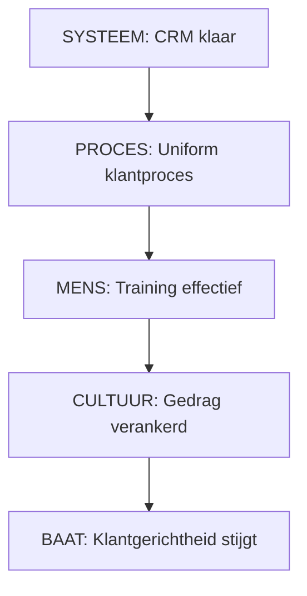

# Deel 4: Inspanningsstructuur

> **Bron:** Werken aan Programma's (Björn Prevaas & Niels van Loon)
> **Thema:** 2 & 4 - Hoofdstuk 11: Overzicht en samenhang
> **Toepassing:** Klant in Beeld (Cito)

---

## HOOFDSTUK 11: OVERZICHT EN SAMENHANG

### 11.1 Doelen-Inspanningennetwerk

**Definitie:** Relaties tussen programmadoelen, domeinbaten, sectorbaten en inspanningen

> **Kernprincipe:** Sturing moet van doelen/baten naar inspanningen lopen, niet andersom

```
PROGRAMMADOEL
"Cito wordt outside-in organisatie"
         ↓
DOMEINBATEN (4x)           SECTORBATEN (3x)
├─ MENS: Outside-in        ├─ PO: Churn daling
├─ PROCES: Uniform         ├─ VO: Relatie-duur stijgt
├─ SYSTEEM: 360° beeld     └─ ZAKELIJK: Account-groei
└─ CULTUUR: Norm
         ↓
INSPANNINGEN (4 types)
├─ PROJECTEN
├─ PROCESINSPANNINGEN
├─ LEERTRAJECTEN
└─ SYSTEEMWERK
```

---

### 11.2 Relaties Tussen Inspanningen

#### 4 Soorten Relaties

```
┌─────────────────────────────────────────────────────────────────────┐
│  INSPANNINGSRELATIES                                                │
├─────────────────────────────────────────────────────────────────────┤
│                                                                     │
│  1. AFHANKELIJKHEDEN                                                │
│     Inspanningen die op elkaar wachten; volgorde kritisch          │
│     Voorbeeld: CRM → Procesontwerp → Training                       │
│                                                                     │
│  2. COMPLEMENTARITEIT                                               │
│     Inspanningen die elkaar versterken, niet waterdicht afhankelijk│
│     Voorbeeld: Training + helder proces = beter effect             │
│                                                                     │
│  3. CONFLICTEN                                                      │
│     Inspanningen die tegenwerken of resources concurreren          │
│     Voorbeeld: Snelheid vs. Diepgang                                │
│                                                                     │
│  4. SEQUENTIALISERING                                               │
│     Bewuste volgorde voor maximaal effect                          │
│     Voorbeeld: Eerst fundament, dan implementatie, dan verankering │
│                                                                     │
└─────────────────────────────────────────────────────────────────────┘
```

#### Afhankelijkheden Klant in Beeld



---

### 11.3 Inspanningendossier

**Inhoud per inspanning:**

```
┌────────────────────────────────────────────────────────────────────┐
│  INSPANNINGENDOSSIER                                               │
├────────────────────────────────────────────────────────────────────┤
│                                                                    │
│  A. BASISGEGEVENS                                                  │
│     • Type (Project/Proces/Leer/Systeem)                           │
│     • Eigenaar, Start, Einde, Budget, FTE's                        │
│                                                                    │
│  B. DOELEN & BATEN                                                 │
│     • Directe output (deliverables)                                │
│     • Domeinbaten die afhangen                                     │
│     • Sectorbaten (eindresultaat)                                  │
│                                                                    │
│  C. AFHANKELIJKHEDEN                                               │
│     • Voorgaande inspanningen (blokkeurs)                          │
│     • Parallelle inspanningen (raakvlakken)                        │
│     • Volgende inspanningen (enabler)                              │
│                                                                    │
│  D. RISICO'S & MITIGATIE                                           │
│     • Risico → Mitigatie per item                                  │
│                                                                    │
│  E. VOORTGANG                                                      │
│     • Plan vs. Werkelijkheid                                       │
│     • Status: Groen/Geel/Rood                                      │
│                                                                    │
└────────────────────────────────────────────────────────────────────┘
```

---

### 11.4 Routekaart

**Klant in Beeld - 18 maanden:**

```
FASE 1: FUNDAMENT        FASE 2: IMPLEMENTATIE     FASE 3: VERANKERING
(M1-M3)                  (M4-M9)                   (M10-M18)

SYSTEEM
├─ CRM Analyse    [===]
├─ CRM Build              [==========]
├─ Data integratie         [============]
└─ Dashboard                         [====] ─────────────────────────

PROCES
├─ Ontwerp        [==========]
├─ Pilot                  [====]
├─ Full Rollout                [=========]
└─ Optimalisatie                              [======] ──────────────

MENS
├─ Leadership     [=======]
├─ Training               [=====] [=====] [=====]
└─ Coaching                    [─────────────────────────]

CULTUUR
├─ Mobilisering   [→]
├─ Communicatie          [========] ──────────────────────────────
└─ Succesgedeelde              [========] ───────────────────────

MILESTONES:        M3           M9              M18
                 FUNDAMENT    IMPLEMENTATIE   VERANKERING
```

---

## 4 INSPANNINGSTYPES

### TYPE 1: PROJECTEN

**Definitie:** Afgebakend, uniek, eenmalig resultaat

| Kenmerk | Beschrijving |
|---------|--------------|
| **Duidelijke output** | Concreet werkproduct |
| **Eindpunt** | Duidelijke finish-line |
| **Risico's** | Scope-creep, vertraging |
| **Afsluiting** | Oplevering en overdracht |

**Voorbeelden Klant in Beeld:**
- Herontwerp Klantreis PO/VO/Zakelijk
- CRM Implementatie
- Verkenning Klantbehoeften

---

### TYPE 2: PROCESINSPANNINGEN

**Definitie:** Duurzame verbetering van werkprocessen

| Kenmerk | Beschrijving |
|---------|--------------|
| **Duur** | Langdurig (vaak jaren) |
| **Cyclisch** | Ontwerp → Invoering → Evaluatie → Aanpassing |
| **Sectoroverstijgend** | Afstemming tussen afdelingen |
| **Borging** | Ingebed in standaardwerk |

**Voorbeelden Klant in Beeld:**
- Uniform Klantproces
- Vaste Cyclus Klantinzichten
- Rolverdeling en Escalatie

**Fases:**
1. ANALYSE (M1-2)
2. ONTWERP (M2-3)
3. INVOERING (M4-6)
4. BORGING (M6+)

---

### TYPE 3: LEER- EN GEDRAGSTRAJECTEN

**Definitie:** Ontwikkelen van vaardigheden, houding, mindset

| Kenmerk | Beschrijving |
|---------|--------------|
| **Meerjarig** | Niet eenmalig, structureel |
| **Cyclisch** | Repetitie, reflectie, aanpassing |
| **Begeleiding** | Coaching, intervisie, mentoring |
| **Borging** | Via leiderschap en succesverhalen |

**Voorbeelden Klant in Beeld:**
- Outside-In Training
- Leiderschapsprogramma
- Intervisiegroepen

**Interventievormen:**
```
TRAININGEN    → Kennis & basisvaardigheden
COACHING      → Toepassing & verankering
REFLECTIE     → Inzicht & verbetering
BORGING       → Gedragsverandering
```

---

### TYPE 4: SYSTEEM- EN DATAINSPANNINGEN

**Definitie:** IT-systemen, data-infrastructuur, technische koppelingen

| Kenmerk | Beschrijving |
|---------|--------------|
| **Technisch complex** | Meerjarig, veel afhankelijkheden |
| **Data bewaking** | Kwaliteit, security, compliance |
| **User adoption** | Systeem nutteloos zonder gebruik |
| **Continuous** | Mee-evolueren met organisatie |

**Voorbeelden Klant in Beeld:**
- CRM Verbetering
- Data-integratie
- Rapportage & Dashboard

**Fases:**
1. ANALYSE & ONTWERP (M1-2)
2. BUILD & TEST (M3-9)
3. CUTOVER (M10-11)
4. OPTIMIZATION (M12+)

---

## KOPPELING INSPANNINGEN AAN BATEN

### Effectpad (Logic Model)

```
INSPANNING    →    OUTPUT         →    OUTCOME        →    IMPACT

Training      →   Teams           →   Nieuw gedrag    →    Klanten
"outside-in"      gecertificeerd     in klantcontact      merken verschil

CRM-verbetering → 360° beeld     → Accountmanagers  →    Proactieve
                                    zien behoefte        dienstverlening

Uniform proces → Werkstroom      → Geen verlies     →    Klanten
                 standaard         van informatie        ervaren consistentie
```

---

## KRITIEKE SAMENHANGSREGELS

| Regel | Toelichting |
|-------|-------------|
| **Systeem ondersteunt Proces** | CRM-ontwerp volgt op procesontwerp |
| **Proces vereist Mens-ontwikkeling** | Teams moeten weten HOE |
| **Mens-gedrag verankert in Cultuur** | Leiderschap stimuleert gedrag |
| **Cultuur versterkt Systeem-adoptie** | Teams gebruiken systeem als mindset er is |
| **Eigenaarschap bepaalt snelheid** | Baateigenaren moeten ECHT willen |

---

## VEELGEMAAKTE FOUTEN

| Fout | Voorkoming |
|------|------------|
| Inspanningen los van baten | Begin ALTIJD met doelen/baten |
| Afhankelijkheden niet zien | Maak afhankelijkheidslog VOOR opstart |
| Geen eigenaarschap | Zorg dat eigenaar KIEST |
| Baten niet gemeten | Definieer succes-indicator per inspanning |
| Systeem zonder proces | Procesontwerp voor systeem-keuze |
| Cultuurverandering vergeten | Investeer evenveel in cultuur als systeem |

---

## CHECKLIST INSPANNINGSSTRUCTUUR

```
☐ BATEN (TOP-DOWN)
  ☐ Programmadoel geformuleerd
  ☐ Domeinbaten per domein gedefinieerd
  ☐ Sectorbaten per sector bepaald
  ☐ Baateigenaren benoemd

☐ INSPANNINGEN (BOTTOM-UP)
  ☐ Per baat bepaald: welke inspanningen nodig?
  ☐ Inspanningstypes bepaald
  ☐ Inspanningsleiders gekozen
  ☐ Dossiers per inspanning opgesteld

☐ AFHANKELIJKHEDEN
  ☐ Afhankelijkheidslog ingevuld
  ☐ Kritieke paden geïdentificeerd
  ☐ Voorgaande/volgende relaties helder

☐ ROUTEKAART
  ☐ Routekaart getekend
  ☐ Go/no-go momenten gemarkeerd
  ☐ Milestones gedefinieerd

☐ MONITORING
  ☐ Per inspanning: succes-indicators
  ☐ Per baat: meet-cadans
  ☐ Programmaraad-cyclus gedefinieerd
```

---

*Gegenereerd: 10 januari 2026*
*Fase 1 - Theorie Deel 4 afgerond*
