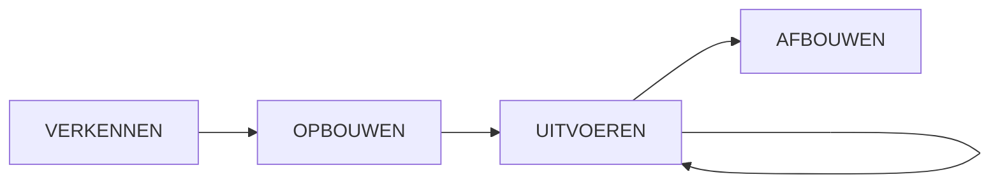

# Deel 5: Fasering en Besluitvorming

> **Bron:** Werken aan Programma's (Björn Prevaas & Niels van Loon)
> **Thema:** 1 (H6) + 5 (H23-25) - KIEZEN + BESLISSEN
> **Toepassing:** Klant in Beeld (Cito)

---

## LEVENSLOOPFASEN (Hoofdstuk 6)

### De Vier Stadia



---

### 6.2 VERKENNEN

**Doel:** Kiezen om de opgave wel of niet aan te pakken als programma

**Kernvragen:**
- Hoe ziet de huidige situatie eruit?
- Hoe belangrijk en urgent is het vraagstuk?
- Welke prioriteit t.o.v. andere initiatieven?
- Waarom kan de staande organisatie dit niet zelf?
- Welke aanpak past het best?
- Wie zijn eigenaar, manager, bateneigenaren?

**Resultaten:**
- Initiële visie op de opgave
- Programmavoorstel
- Initiële businesscase
- Opbouwplan
- **Go/No-go beslissing**

---

### 6.3 OPBOUWEN

**Doel:** Programma concreet inrichten zodat betrokkenen zich eraan verbinden

**Karakteristieken:**
- Start met opbouwopdracht
- Reeks bouwsessies (niet één bijeenkomst)
- Groepsformatie + onderhandeling over belangen
- Kan weken tot maanden duren

**Resultaten:**
- Programmaplan
- Businesscase (uitgewerkt)
- Eerste cyclusplan
- **Go/No-go op uitvoering**

**Kritieke vragen:**
- Welke strategie, welke inspanningen wanneer?
- Welke middelen nodig?
- Hoe organiseren we rollen?
- Hoe monitoren we voortgang?

---

### 6.4 UITVOEREN

**Doel:** Realiseren van inspanningen, vermogens en baten

**Kernstructuur: CYCLI**
- Cyclus = periode om van één plateau naar volgende te gaan
- Typische cyclus: 6-9 maanden
- **Incrementeel**: Geleidelijk opbouw en ingebruikname
- **Iteratief**: Ontdekken via test-versies en feedback

**Stappen per cyclus:**
1. Plan per cyclus (richting geven)
2. Inspanningsplannen uitvoeren
3. Resultaten opleveren
4. Voortgang monitoren
5. Einde cyclus: balans, reflectie, vooruitkijken
6. Besluit over vervolg of afbouw

---

### 6.5 AFBOUWEN

**Doel:** Zorgvuldig afronden, borging van opbrengsten

**Redenen voor afbouw:**
- **Planmatig**: Baten voldoende gerealiseerd
- **Voortijdig**: Andere prioriteiten, onvoldoende baten

**Kritieke vraag:** Is de organisatie klaar om het zelf over te nemen?

**Resultaten:**
- Programmareview
- Afbouwplan
- Afrondingsdocument
- Dechargedocument

> **WAARSCHUWING:** Afbouw wordt vaak afgeraffeld! Risico: oogst valt "dood voor de kast neer"

---

## THEMA 5: BESLISSEN (Hoofdstukken 23-25)

### Hoofdstuk 23: Wie Beslist Waarover

#### 7 Principes

```
┌─────────────────────────────────────────────────────────────────────┐
│  7 BESLUITVORMINGSPRINCIPES                                         │
├─────────────────────────────────────────────────────────────────────┤
│                                                                     │
│  1. Besluiten worden genomen door PROGRAMMAROLLEN                   │
│     (niet door mensen zonder rol)                                   │
│                                                                     │
│  2. Beslissingen liggen eerst bij MENSEN, dan bij OVERLEGGEN       │
│     (voorkom: alles naar stuurgroep)                               │
│                                                                     │
│  3. Beperk AANTAL ROLLEN en NIVEAUS                                 │
│     (eenvoud = duidelijkheid)                                       │
│                                                                     │
│  4. Beslissingen zo LAAG als mogelijk, zo HOOG als nodig           │
│     (eigenaarschap + snelheid)                                      │
│                                                                     │
│  5. BELANG VAN DE OPGAVE is leidend (niet eigenbelang)             │
│     (collectief > individueel)                                      │
│                                                                     │
│  6. Beslissing volgt altijd het PROCES                              │
│     (geen shortcuts)                                                │
│                                                                     │
│  7. Geen beslissing zonder IMPACT duidelijk                         │
│     (hoewel niet altijd volledig te overzien)                       │
│                                                                     │
└─────────────────────────────────────────────────────────────────────┘
```

#### Beslissingen per Niveau

| Niveau | Beslissingen |
|--------|--------------|
| **Sponsorgroep** | Verkenningsopdracht, benoeming PM, prioritering, afbouwbesluit |
| **Programma-eigenaar** | Visie, voorstel, businesscase, start opbouw, middelen |
| **PM/Bateneigenaar** | Opdrachten inspanningen, faseplannen, wijzigingen binnen kaders |
| **Inspanningsleider** | Alle besluiten voor uitvoering binnen plan |

---

### Hoofdstuk 24: Besluitvormingsproces

#### 6-Stappen Model

```
┌─────────────────────────────────────────────────────────────────────┐
│  6-STAPPEN BESLUITVORMINGSPROCES                                    │
├─────────────────────────────────────────────────────────────────────┤
│                                                                     │
│  STAP 1: VRAAGSTUK DEFINIËREN                                       │
│          • Formuleer helder het probleem                            │
│          • Bepaal wie de beslisser is                               │
│          • Wat moet bereikt zijn?                                   │
│                                                                     │
│  STAP 2: IDEEËN, HAALBAARHEID EN DRAAGVLAK ONDERZOEKEN             │
│          • Verzamel informatie                                      │
│          • Genereer alternatieven (minimaal 3!)                     │
│          • Betrek juiste mensen                                     │
│          • Test voorgenomen besluit                                 │
│                                                                     │
│  STAP 3: GEDRAGEN BESLUIT NEMEN                                     │
│          • Duidelijk wie beslist                                    │
│          • Afspraken over uitvoering                                │
│          • Vastleggen in logboek                                    │
│          • Expliciet uitdragen                                      │
│                                                                     │
│  STAP 4: BESLUIT UITVOEREN EN HANDHAVEN                            │
│          • Implementatie                                            │
│          • Communicatie naar betrokkenen                            │
│          • Voortgang monitoren                                      │
│          • Elkaar aanspreken                                        │
│                                                                     │
│  STAP 5: REFLECTEREN OP HET PROCES                                 │
│          • Terugkijken op dit besluit                               │
│          • Wat leren we?                                            │
│                                                                     │
│  STAP 6: BESLUITVORMING VERBETEREN                                 │
│          • Input voor volgende beslissing                           │
│                                                                     │
└─────────────────────────────────────────────────────────────────────┘
```

#### Instrumenten

| Instrument | Doel |
|------------|------|
| **Besliscanvas** | Cocreatie rondom besluit |
| **Beslisdocument** | Beschrijft wat nodig voor keuze |
| **Besluitenlijst (LOGBOEK)** | Vastleggen wat IS besloten - CRUCIAAL! |
| **Checklist goed besluit** | Eenduidig? Onderbouwd? Gedragen? Uitvoerbaar? Tijdig? |

---

### Hoofdstuk 25: Besluiten Nemen en Handhaven

#### 7 Regievariabelen (7 T's)

```
THEMA     → Onderwerp/vraagstuk bepalen
TIMING    → Juiste momenten kiezen
TEMPO     → Snelheid proces bepalen
TOEGANG   → Selecteren deelnemers
TONEEL    → Juiste omgeving creëren
TOON      → Passend communiceren
TOL       → Bijdrage/tol bewust zijn
```

#### Macht en Communicatie

**Macht** = vermogen richting te geven aan gedrag
- Positiemacht (formele rol)
- Persoonsmacht (wie je bent)

**Communicatie** = inhoudskwaliteit
- Inhoud (waarover?)
- Procedure (hoe?)
- Interactie (wat tussen mensen?)
- Gevoel (wat voelt het?)

**Discussie vs. Dialoog:**

| Discussie | Dialoog |
|-----------|---------|
| Spreektijd opeisen | Elkaar ruimte geven |
| Elkaar overtuigen | Elkaar begrijpen |
| Standpunten ondergraven | Verschil onderzoeken |
| Instemming voor eigen standpunt | Gezamenlijk inzicht |

---

## GO/NO-GO MOMENTEN

```
┌─────────────────────────────────────────────────────────────────────┐
│  GO/NO-GO MOMENTEN PER STADIUM                                      │
├─────────────────────────────────────────────────────────────────────┤
│                                                                     │
│  VERKENNING                                                         │
│  └─ GO: Sponsorgroep keurt programmavoorstel goed → START OPBOUW   │
│                                                                     │
│  OPBOUW                                                             │
│  └─ GO: Eigenaar keurt programmaplan goed → START UITVOERING       │
│                                                                     │
│  UITVOERING (per cyclus)                                            │
│  ├─ Begin: Keuzes inspanningen, prioriteit                          │
│  ├─ Einde: Evaluatie, reflectie, GO volgende cyclus                │
│  └─ Mid-term: Reviews (risico's, effecten, draagvlak)              │
│                                                                     │
│  AFBOUW                                                             │
│  └─ STOP: Sponsorgroep keurt afbouwplan goed → START AFBOUW        │
│                                                                     │
└─────────────────────────────────────────────────────────────────────┘
```

---

## TOEPASSING OP KLANT IN BEELD

### Huidige Positie

```
VERKENNEN  ✓     OPBOUWEN  ← HIER     UITVOEREN      AFBOUWEN
[Afgerond]       [Go-besluit MT       [Gepland]      [Toekomst]
                  nog uit te voeren]
```

### Keuzes voor MT-Sessie

**Wie beslist?** MT als Sponsorgroep

**Wat is de vraag?** GO voor opbouw + programmaplan?

**Alternatieven:**
1. Programmatische aanpak (aanbevolen)
2. Projectmatige benadering (minder geschikt)
3. Lijnwerk (onvoldoende)

**Criteria:** Haalbaarheid, middelen, urgentie

### Mandaten Klant in Beeld

| Rol | Mandaat |
|-----|---------|
| **Programma-eigenaar** | Eigenaarschap batenrealisatie |
| **Programmamanager** | Uitvoering + samenhang |
| **Baateigenaren** | Strategische eigenaarschap per domein |
| **Inspanningsleiders** | Operationele keuzes binnen kaders |

### Volgende Stappen

1. **Programmaplan + businesscase afmaken**
2. **MT-sessie: GO op programmatische aanpak?**
3. **Opbouwfase: Bouwsessies, governance**
4. **Cycli bepalen: Wie doet wat, wanneer?**
5. **Sturing: Voortgangsbewaking per cyclus**

---

## SAMENVATTING

### Levensloop
- Vier stadia: Verkennen → Opbouwen → Uitvoeren → Afbouwen
- **Cycli in uitvoering** = incrementeel opbouwen
- Elk **einde stadium/cyclus** = rust, reflectie, keuze
- **Afbouw niet afrafelen**

### Besluitvorming
- **Principes**: Eigenaarschap, laag niveau, proces, belang opgave
- **6-stappen proces**: Vraag → ideeën → besluit → uitvoering → reflectie → verbetering
- **3 alternatieven voorleggen** (niet één)
- **Besluiten vastleggen in logboek**
- **Macht + communicatie** beide nodig

---

*Gegenereerd: 10 januari 2026*
*Fase 1 - Theorie Deel 5 afgerond*
