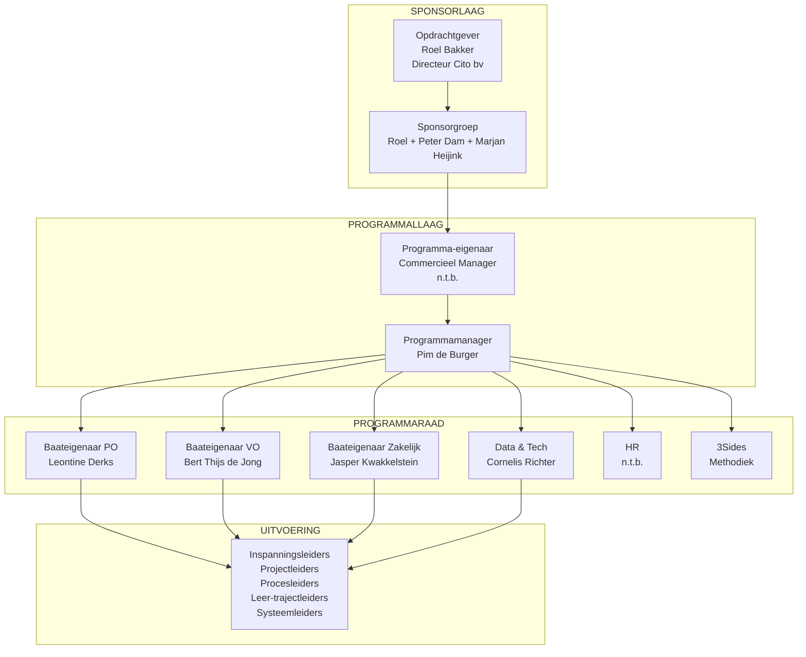
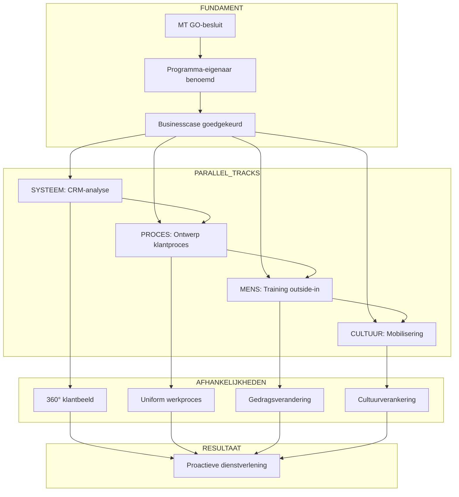

# Contextkaart Klant in Beeld

> **Programma:** Klant in Beeld (Cito)
> **Gegenereerd:** 10 januari 2026
> **Fase:** 2 - Context Inlezen

---

## VISUELE CONTEXTKAART

```
                              ┌──────────────────────────────┐
                              │      STRATEGISCHE LAAG       │
                              │   "Outside-in organisatie"   │
                              └──────────────┬───────────────┘
                                             │
              ┌──────────────────────────────┼──────────────────────────────┐
              │                              │                              │
              ▼                              ▼                              ▼
┌─────────────────────────┐    ┌─────────────────────────┐    ┌─────────────────────────┐
│     SECTOR: PO          │    │     SECTOR: VO          │    │   SECTOR: ZAKELIJK      │
│  Baateigenaar: Leontine │    │ Baateigenaar: Bert Thijs│    │ Baateigenaar: Jasper    │
│  Fase 3 (einde)         │    │ Fase 3 (einde)          │    │ Fase 2 (begin)          │
└───────────┬─────────────┘    └───────────┬─────────────┘    └───────────┬─────────────┘
            │                              │                              │
            └──────────────────────────────┼──────────────────────────────┘
                                           │
              ┌────────────────────────────┼────────────────────────────┐
              │                            │                            │
              ▼                            ▼                            ▼
   ┌──────────────────┐         ┌──────────────────┐         ┌──────────────────┐
   │                  │         │                  │         │                  │
   │      MENS        │◄───────►│     PROCES       │◄───────►│     SYSTEEM      │
   │                  │         │                  │         │                  │
   │  Vaardigheden    │         │  Klantproces     │         │  CRM/Data        │
   │  Mindset         │         │  Uniformiteit    │         │  360° beeld      │
   │  Rollen          │         │  Borging         │         │  Kwaliteit       │
   │                  │         │                  │         │                  │
   └────────┬─────────┘         └────────┬─────────┘         └────────┬─────────┘
            │                            │                            │
            └────────────────────────────┼────────────────────────────┘
                                         │
                                         ▼
                              ┌──────────────────────────────┐
                              │         CULTUUR              │
                              │  "Klantgericht als norm"     │
                              │  Eigenaarschap, proactiviteit│
                              └──────────────────────────────┘
```

---

## STATUS PER DOMEIN

### MENS

```
┌─────────────────────────────────────────────────────────────────────────────┐
│  DOMEIN: MENS                                                    STATUS: 🟡 │
├─────────────────────────────────────────────────────────────────────────────┤
│                                                                             │
│  HUIDIGE SITUATIE (AS-IS)                                                   │
│  ─────────────────────────                                                  │
│  • Medewerkers onvoldoende vaardig in outside-in denken                     │
│  • Geen vaste structuur in klantgesprekken                                  │
│  • Moeite met vertalen klantdata naar concrete keuzes                       │
│  • Rolonduidelijkheid tussen sector, sales, data & tech                     │
│  • Weinig structurele oefenruimte voor nieuw gedrag                         │
│  • Terugval in inside-out patronen bij gebrek aan coaching                  │
│                                                                             │
│  GEWENSTE SITUATIE (TO-BE)                                                  │
│  ─────────────────────────                                                  │
│  • Vaardigheden outside-in structureel ontwikkeld                           │
│  • Houding en mindset versterkt                                             │
│  • Rollen en verantwoordelijkheden helder                                   │
│  • Ruimte voor oefenen, reflectie en feedback                               │
│                                                                             │
│  GEPLANDE INSPANNINGEN                                                      │
│  ─────────────────────────                                                  │
│  • Trainingen outside-in werken                                             │
│  • Leiderschapsprogramma's                                                  │
│  • Coaching-on-the-job                                                      │
│  • Intervisie en casusbesprekingen                                          │
│  • Train-de-trainer trajecten                                               │
│                                                                             │
│  VERANTWOORDELIJKE                                                          │
│  ─────────────────────────                                                  │
│  Programmaraad: HR-vertegenwoordiger (n.t.b.)                               │
│  Ondersteuning: 3Sides (methodiek)                                          │
│                                                                             │
│  STUURPARAMETERS                                                            │
│  Prioriteit 1: Haalbaarheid │ Prioriteit 2: Doeltreffendheid │ Tempo: Matig │
│                                                                             │
│  KPI's                                                                      │
│  • % medewerkers getraind                                                   │
│  • Tevredenheidsscores                                                      │
│  • Gedragsobservatie-resultaten                                             │
│                                                                             │
└─────────────────────────────────────────────────────────────────────────────┘
```

### PROCES

```
┌─────────────────────────────────────────────────────────────────────────────┐
│  DOMEIN: PROCES                                                  STATUS: 🟡 │
├─────────────────────────────────────────────────────────────────────────────┤
│                                                                             │
│  HUIDIGE SITUATIE (AS-IS)                                                   │
│  ─────────────────────────                                                  │
│  • Geen organisatiebreed uniform klantproces                                │
│  • Elke sector eigen werkwijze, definities, documenten                      │
│  • Vastlegging klantinzichten versnipperd                                   │
│  • Overdrachtsmomenten niet eenduidig belegd                                │
│  • Eerdere initiatieven niet structureel verankerd                          │
│  • Klantreis te breed en ambitieus ingestoken                               │
│                                                                             │
│  GEWENSTE SITUATIE (TO-BE)                                                  │
│  ─────────────────────────                                                  │
│  • Organisatiebreed klantproces ontworpen en geïmplementeerd                │
│  • Heldere opvolgstructuur voor klantinzichten                              │
│  • Uniforme rollen, afspraken, definities en ritmes                         │
│  • Klantgericht werken geborgd in standaard werkwijze                       │
│                                                                             │
│  GEPLANDE INSPANNINGEN                                                      │
│  ─────────────────────────                                                  │
│  • Ontwerp organisatiebreed klantproces                                     │
│  • Vaste cyclus klantinzichten                                              │
│  • Uniformeren definities en rolverdeling                                   │
│  • Vastleggen en onderhouden klantcontactprocessen                          │
│                                                                             │
│  VERANTWOORDELIJKE                                                          │
│  ─────────────────────────                                                  │
│  Baateigenaren: Sectormanagers (PO, VO, Zakelijk)                           │
│  Coördinatie: Programmamanager                                              │
│                                                                             │
│  STUURPARAMETERS                                                            │
│  Prioriteit 1: Doeltreffendheid │ Prioriteit 2: Efficiëntie │ Tempo: Medium-hoog │
│                                                                             │
│  KPI's                                                                      │
│  • Procesnaleving %                                                         │
│  • Cyclustijd klantverzoeken                                                │
│  • Consistentie tussen sectoren                                             │
│                                                                             │
└─────────────────────────────────────────────────────────────────────────────┘
```

### SYSTEEM

```
┌─────────────────────────────────────────────────────────────────────────────┐
│  DOMEIN: SYSTEEM                                                 STATUS: 🟠 │
├─────────────────────────────────────────────────────────────────────────────┤
│                                                                             │
│  HUIDIGE SITUATIE (AS-IS)                                                   │
│  ─────────────────────────                                                  │
│  • Klantinformatie verspreid over verschillende systemen                    │
│  • CRM sluit niet goed aan bij gewenst klantproces                          │
│  • Datakwaliteit onvoldoende voor betrouwbare sturing                       │
│  • Geen integraal klantbeeld beschikbaar                                    │
│  • Beperkte koppelingen tussen systemen en databronnen                      │
│                                                                             │
│  GEWENSTE SITUATIE (TO-BE)                                                  │
│  ─────────────────────────                                                  │
│  • CRM en klantdata-infrastructuur verbeterd                                │
│  • Integraal 360-graden klantbeeld                                          │
│  • Uniforme en verbeterde datakwaliteit                                     │
│  • Proactieve dienstverlening gefaciliteerd vanuit systemen                 │
│                                                                             │
│  GEPLANDE INSPANNINGEN                                                      │
│  ─────────────────────────                                                  │
│  • CRM verbetering en herinrichting                                         │
│  • Uniformeren en opschonen klantdata                                       │
│  • Integreren databronnen                                                   │
│  • Ontwikkelen dashboards en rapportages                                    │
│  • Technische koppelingen inrichten                                         │
│                                                                             │
│  VERANTWOORDELIJKE                                                          │
│  ─────────────────────────                                                  │
│  Data & Tech: Cornelis Richter                                              │
│  Systeem- en datatrajectleiders: n.t.b.                                     │
│                                                                             │
│  STUURPARAMETERS                                                            │
│  Prioriteit 1: Haalbaarheid │ Prioriteit 2: Tempo │ Tempo: Medium           │
│                                                                             │
│  KPI's                                                                      │
│  • CRM-adoptie %                                                            │
│  • Datakwaliteitsscore                                                      │
│  • Dashboard-gebruik                                                        │
│                                                                             │
└─────────────────────────────────────────────────────────────────────────────┘
```

### CULTUUR

```
┌─────────────────────────────────────────────────────────────────────────────┐
│  DOMEIN: CULTUUR                                                 STATUS: 🟠 │
├─────────────────────────────────────────────────────────────────────────────┤
│                                                                             │
│  HUIDIGE SITUATIE (AS-IS)                                                   │
│  ─────────────────────────                                                  │
│  • Reflex productgericht en aanbod gestuurd                                 │
│  • Eigenaarschap klantrelatie versnipperd                                   │
│  • Sectoroverstijgende samenwerking niet vanzelfsprekend                    │
│  • Moeite met focussen op wat voor klanten relevant is                      │
│  • Afwachtend gedrag i.p.v. proactief                                       │
│  • Successen onvoldoende gedeeld                                            │
│                                                                             │
│  GEWENSTE SITUATIE (TO-BE)                                                  │
│  ─────────────────────────                                                  │
│  • Van productgericht naar klantgericht denken en handelen                  │
│  • Gedeeld eigenaarschap voor klantrelaties                                 │
│  • Sectoroverstijgende samenwerking genormaliseerd                          │
│  • Proactief gedrag, keuzes bespreekbaar                                    │
│                                                                             │
│  GEPLANDE INSPANNINGEN                                                      │
│  ─────────────────────────                                                  │
│  • Cultuurverandering via leiderschap                                       │
│  • Succesverhalen delen                                                     │
│  • Communicatie over programma en voortgang                                 │
│  • Leiderschap stimuleren gewenst gedrag                                    │
│                                                                             │
│  VERANTWOORDELIJKE                                                          │
│  ─────────────────────────                                                  │
│  Programma-eigenaar: Commercieel Manager (n.t.b.)                           │
│  Ondersteuning: 3Sides, HR                                                  │
│                                                                             │
│  STUURPARAMETERS                                                            │
│  Prioriteit 1: Haalbaarheid │ Prioriteit 2: Wendbaarheid │ Tempo: Langzaam  │
│                                                                             │
│  KPI's                                                                      │
│  • Eigenaarschapsmeting                                                     │
│  • Proactieve initiatieven                                                  │
│  • Cultuurenquête scores                                                    │
│                                                                             │
└─────────────────────────────────────────────────────────────────────────────┘
```

---

## STAKEHOLDER-OVERZICHT

### Governance Rollen



### Stakeholder Matrix

| Stakeholder | Rol | Mandaat | Status |
|-------------|-----|---------|--------|
| **Roel Bakker** | Opdrachtgever | Mandaat, doelbeeld, strategische aansluiting | Actief |
| **Peter Dam** | Sponsorgroep | Blokkades oplossen, randvoorwaarden | Actief |
| **Marjan Heijink** | Sponsorgroep | Samenhang andere initiatieven | Actief |
| **Commercieel Manager** | Programma-eigenaar | Richting, batenrealisatie, MT-verbinding | **N.T.B.** |
| **Pim de Burger** | Programmamanager | Dagelijkse leiding, samenhang, risico's | Actief |
| **Leontine Derks** | Baateigenaar PO | Baten PO definiëren, inspanningen initiëren | Actief |
| **Bert Thijs de Jong** | Baateigenaar VO | Baten VO definiëren, inspanningen initiëren | Actief |
| **Jasper Kwakkelstein** | Baateigenaar Zakelijk | Baten Zakelijk definiëren, inspanningen initiëren | Actief |
| **Cornelis Richter** | Data & Tech | Systeembaten, CRM-verandering | Actief |
| **HR-vertegenwoordiger** | Mens-domein | Vaardigheden, training, coaching | **N.T.B.** |
| **3Sides** | Methodiek-expert | Consultancy, coaching, kwaliteitsborging | Actief |

---

## WAT IS BESLOTEN VS. NOG OPEN

### Besloten (Vastgesteld)

```
┌─────────────────────────────────────────────────────────────────────────────┐
│  BESLOTEN                                                                   │
├─────────────────────────────────────────────────────────────────────────────┤
│                                                                             │
│  STRUCTUREEL                                                                │
│  ────────────                                                               │
│  ✓ Programmatische aanpak (geen projecten of lijnwerk)                      │
│  ✓ 4 domeinen: Mens, Proces, Systeem, Cultuur                               │
│  ✓ 4 inspanningstypes: Projecten, Proces, Leer, Systeem                     │
│  ✓ 3 sectoren: PO, VO, Zakelijk/Professionals                               │
│                                                                             │
│  GOVERNANCE                                                                 │
│  ──────────                                                                 │
│  ✓ Opdrachtgever: Roel Bakker                                               │
│  ✓ Sponsorgroep: Roel + Peter Dam + Marjan Heijink                          │
│  ✓ Programmamanager: Pim de Burger                                          │
│  ✓ Baateigenaren: Sectormanagers (PO, VO, Zakelijk)                         │
│  ✓ Data & Tech vertegenwoordiger: Cornelis Richter                          │
│  ✓ Externe partner: 3Sides                                                  │
│                                                                             │
│  METHODIEK                                                                  │
│  ─────────                                                                  │
│  ✓ Procesflow: Identificeer → Analyseer → Ontwerp → Implementeer            │
│  ✓ Leerbenadering: Voordoen → Samen doen → Zelf doen                        │
│  ✓ Implementatiestrategie: Participatiestrategie                            │
│  ✓ Theoretisch kader: "Werken met Programma's"                              │
│                                                                             │
│  DOELBEELD                                                                  │
│  ─────────                                                                  │
│  ✓ Programma-doel geformuleerd (nog te accorderen door opdrachtgever)       │
│  ✓ Outside-in perspectief als kernprincipe                                  │
│  ✓ Verbinding mens-proces-systeem-cultuur                                   │
│                                                                             │
└─────────────────────────────────────────────────────────────────────────────┘
```

### Nog Open (Besluit Nodig)

```
┌─────────────────────────────────────────────────────────────────────────────┐
│  NOG OPEN - BESLUIT NODIG                                                   │
├─────────────────────────────────────────────────────────────────────────────┤
│                                                                             │
│  HOGE PRIORITEIT (Blokkerend voor voortgang)                                │
│  ──────────────────────────────────────────                                 │
│  ○ GO/NO-GO MT op programmatische aanpak                                    │
│  ○ Programma-eigenaar benoemen (Commercieel Manager n.t.b.)                 │
│  ○ HR-vertegenwoordiger benoemen                                            │
│  ○ Businesscase formaliseren                                                │
│  ○ Begroting 2026 opstellen                                                 │
│  ○ Fasering en planning 2026 concretiseren                                  │
│                                                                             │
│  MEDIUM PRIORITEIT (Nodig voor uitvoering)                                  │
│  ─────────────────────────────────────────                                  │
│  ○ Batenprofielen per sector uitwerken                                      │
│  ○ Effectdoelen SMART formuleren                                            │
│  ○ Gap-analyse wens vs. werkelijkheid opstellen                             │
│  ○ Risicolog formeel opstellen                                              │
│  ○ Onderscheid lijn- vs. programma-activiteiten expliciet maken             │
│  ○ Inspanningsleiders benoemen                                              │
│                                                                             │
│  LAGERE PRIORITEIT (Uitwerking in latere fase)                              │
│  ─────────────────────────────────────────────                              │
│  ○ Monitoring-dashboard inrichten                                           │
│  ○ Overlegstructuur definitief vaststellen                                  │
│  ○ Cyclusplan eerste cyclus opstellen                                       │
│  ○ Afbouwplan (toekomst)                                                    │
│                                                                             │
└─────────────────────────────────────────────────────────────────────────────┘
```

---

## GAP-ANALYSE: THEORIE VS. PRAKTIJK

### Overzicht Gaps

```
┌═══════════════════════════════════════════════════════════════════════════════┐
│  GAP-ANALYSE THEORIE ("Werken met Programma's") vs. PRAKTIJK (Draft)          │
├───────┬─────────────────────────┬────────────────────────┬────────────────────┤
│  #    │ THEORIE VEREIST         │ HUIDIGE STATUS         │ ACTIE NODIG        │
├═══════╪═════════════════════════╪════════════════════════╪════════════════════┤
│  1    │ Businesscase verplicht  │ Nog niet opgesteld     │ Opstellen          │
│       │ bij start opbouwfase    │                        │ PRIORITEIT: HOOG   │
├───────┼─────────────────────────┼────────────────────────┼────────────────────┤
│  2    │ Batenprofielen per      │ Alleen globale baten   │ Uitwerken per      │
│       │ baat met eigenaar       │ beschreven             │ sector/domein      │
│       │                         │                        │ PRIORITEIT: HOOG   │
├───────┼─────────────────────────┼────────────────────────┼────────────────────┤
│  3    │ Gap-analyse             │ Ontbreekt volledig     │ Maken wens vs.     │
│       │ wens vs. werkelijkheid  │ (feedback Roel)        │ werkelijkheid      │
│       │                         │                        │ PRIORITEIT: HOOG   │
├───────┼─────────────────────────┼────────────────────────┼────────────────────┤
│  4    │ Fasering en planning    │ Niet concreet          │ Plan 2026 maken    │
│       │ met mijlpalen           │ (feedback Roel)        │ PRIORITEIT: HOOG   │
├───────┼─────────────────────────┼────────────────────────┼────────────────────┤
│  5    │ Begroting met           │ Ontbreekt              │ Budget opstellen   │
│       │ O-M-G-R-A-P-S structuur │ (feedback Roel)        │ PRIORITEIT: HOOG   │
├───────┼─────────────────────────┼────────────────────────┼────────────────────┤
│  6    │ Formeel risicolog       │ Risico's benoemd,      │ Template invullen  │
│       │ met kans × impact       │ niet geformaliseerd    │ PRIORITEIT: MEDIUM │
├───────┼─────────────────────────┼────────────────────────┼────────────────────┤
│  7    │ Effectdoelen SMART      │ Globaal geformuleerd   │ Concreet maken     │
│       │ toetsbaar               │                        │ PRIORITEIT: MEDIUM │
├───────┼─────────────────────────┼────────────────────────┼────────────────────┤
│  8    │ Helder onderscheid      │ Niet expliciet         │ Afbakening maken   │
│       │ lijn vs. programma      │ (feedback Roel)        │ PRIORITEIT: MEDIUM │
├───────┼─────────────────────────┼────────────────────────┼────────────────────┤
│  9    │ Afhankelijkhedenlog     │ Niet opgesteld         │ Template invullen  │
│       │ tussen inspanningen     │                        │ PRIORITEIT: MEDIUM │
├───────┼─────────────────────────┼────────────────────────┼────────────────────┤
│  10   │ Besluitenlogboek        │ Niet aanwezig          │ Aanmaken en        │
│       │ (BWA-log)               │                        │ bijhouden          │
│       │                         │                        │ PRIORITEIT: MEDIUM │
└═══════╧═════════════════════════╧════════════════════════╧════════════════════┘
```

### Theorie-Referenties per Gap

| Gap | Theorie-hoofdstuk | Template Beschikbaar |
|-----|-------------------|---------------------|
| 1 | H10: Strategie bepalen | `Template-business-case.docx` |
| 2 | H8: Doelen en baten | `Template-batenprofiel.docx` |
| 3 | H8: Doelen en baten | Geen template, zelf maken |
| 4 | H6: Levensloop | `Template-cyclusplan.docx` |
| 5 | H21: Efficiëntie bewaken | `Template-bewaken-programmabudgetten.xlsx` |
| 6 | H19: Haalbaarheid | `Template-risicolog.xlsx` |
| 7 | H8.5: Baten formuleren | `Template-batenprofiel.docx` |
| 8 | H3: Kenmerken programma | Geen template |
| 9 | H11: Overzicht en samenhang | `Template-afhankelijkhedenlog.xlsx` |
| 10 | H24: Besluitvormingsproces | `Template-BWA.xlsx` |

---

## VOORTGANG PER SECTOR

```
┌─────────────────────────────────────────────────────────────────────────────┐
│  VOORTGANG KLANTREISTRAJECTEN                                               │
├─────────────────────────────────────────────────────────────────────────────┤
│                                                                             │
│  FASE 1          FASE 2          FASE 3          FASE 4                     │
│  Identificeer    Analyseer       Ontwerp         Implementeer               │
│                  (AS-IS)         (TO-BE)                                    │
│                                                                             │
│  PO                                                                         │
│  ████████████████████████████████████████████░░░░░░░░░░░░░░░░░░░░░░░░░░░░   │
│  ▲ Fase 3 richting einde                                                    │
│                                                                             │
│  VO                                                                         │
│  ████████████████████████████████████████████░░░░░░░░░░░░░░░░░░░░░░░░░░░░   │
│  ▲ Fase 3 richting einde                                                    │
│                                                                             │
│  Professionals (Zakelijk)                                                   │
│  ████████████░░░░░░░░░░░░░░░░░░░░░░░░░░░░░░░░░░░░░░░░░░░░░░░░░░░░░░░░░░░░   │
│  ▲ Begin Fase 2                                                             │
│                                                                             │
└─────────────────────────────────────────────────────────────────────────────┘
```

---

## HUIDIGE POSITIE IN LEVENSLOOP

```
┌─────────────────────────────────────────────────────────────────────────────┐
│  LEVENSLOOP PROGRAMMA                                                       │
├─────────────────────────────────────────────────────────────────────────────┤
│                                                                             │
│        VERKENNEN         OPBOUWEN         UITVOEREN         AFBOUWEN        │
│  ├─────────────────┼─────────────────┼─────────────────┼─────────────────┤  │
│                                                                             │
│        [AFGEROND]       [◄── HIER]                                          │
│                                                                             │
│  ✓ Drie klantreistra-   ○ Programmaplan      ○ Cycli uitvoeren  ○ Borging   │
│    jecten uitgevoerd      opstellen          ○ Inspanningen     ○ Overdracht│
│  ✓ Patronen geïdenti-   ○ Businesscase         realiseren       ○ Décharge  │
│    ficeerd                formaliseren       ○ Baten meten                  │
│  ✓ Programmatische      ○ GO/NO-GO MT        ○ Bijsturen                    │
│    keuze gemaakt        ○ Governance                                        │
│  ✓ Draft opgesteld        formaliseren                                      │
│                                                                             │
│  KERNVRAAG NU: Is MT klaar om GO te geven op programmatische aanpak?        │
│                                                                             │
└─────────────────────────────────────────────────────────────────────────────┘
```

---

## KRITIEKE AFHANKELIJKHEDEN



### Kritieke Pad

1. **MT GO-besluit** → Zonder dit kan programma niet formeel starten
2. **Programma-eigenaar benoemd** → Cruciaal voor strategische sturing
3. **Businesscase goedgekeurd** → Basis voor middelen en prioritering
4. **CRM-analyse** → Voorwaarde voor procesontwerp (systeem ondersteunt proces)
5. **Procesontwerp** → Voorwaarde voor effectieve training
6. **Training** → Voorwaarde voor gedragsverandering
7. **Cultuurverankering** → Langste pad, afhankelijk van alle andere domeinen

---

## RISICO-OVERZICHT (Voorlopig)

| Risico | Domein | Kans | Impact | Mitigatie |
|--------|--------|------|--------|-----------|
| IT-implementatie vertraagt | Systeem | Hoog | Hoog | Vroeg starten, buffer inbouwen |
| Changemanagement onvoldoende | Mens/Cultuur | Medium | Hoog | 3Sides methodiek, coaching |
| Capaciteit onvoldoende | Alle | Medium | Medium | Prioritering, fasering |
| Strategie-wijziging Cito | Extern | Laag | Hoog | Aansluiting blijven monitoren |
| Politieke dynamiek | Organisatie | Medium | Medium | Stakeholder management |
| Terugval in oud gedrag | Cultuur | Hoog | Medium | Borging, leiderschap |
| Scope creep | Proces | Medium | Medium | Strak mandaat, governance |

---

## VOLGENDE STAPPEN

### Korte Termijn (voor MT-sessie)

```
┌─────────────────────────────────────────────────────────────────────────────┐
│  ACTIES KORTE TERMIJN                                                       │
├─────────────────────────────────────────────────────────────────────────────┤
│                                                                             │
│  1. [ ] Gap-analyse opstellen (wens vs. werkelijkheid)                      │
│  2. [ ] Businesscase concept schrijven                                      │
│  3. [ ] Plan van aanpak 2026 met fasering                                   │
│  4. [ ] Begroting opstellen                                                 │
│  5. [ ] MT-presentatie voorbereiden                                         │
│                                                                             │
└─────────────────────────────────────────────────────────────────────────────┘
```

### MT-Sessie

```
┌─────────────────────────────────────────────────────────────────────────────┐
│  MT-SESSIE AGENDA                                                           │
├─────────────────────────────────────────────────────────────────────────────┤
│                                                                             │
│  1. Presentatie kernuitkomsten drie klantreistrajecten                      │
│  2. Onderbouwing waarom programmatische aanpak                              │
│  3. Uitleg rol baateigenaar                                                 │
│  4. Reflectieopdracht voor baateigenaren                                    │
│  5. GO/NO-GO besluit op programmatische aanpak                              │
│                                                                             │
└─────────────────────────────────────────────────────────────────────────────┘
```

### Na MT GO-besluit

```
┌─────────────────────────────────────────────────────────────────────────────┐
│  ACTIES NA GO-BESLUIT                                                       │
├─────────────────────────────────────────────────────────────────────────────┤
│                                                                             │
│  1. [ ] Programma-eigenaar formeel benoemen                                 │
│  2. [ ] HR-vertegenwoordiger identificeren                                  │
│  3. [ ] Inspanningsleiders selecteren                                       │
│  4. [ ] Batenprofielen per sector uitwerken                                 │
│  5. [ ] Risicolog formeel opstellen                                         │
│  6. [ ] Eerste cyclusplan opstellen                                         │
│  7. [ ] Overlegstructuur formaliseren                                       │
│  8. [ ] Monitoring-dashboard inrichten                                      │
│                                                                             │
└─────────────────────────────────────────────────────────────────────────────┘
```

---

## SAMENVATTING

### Kernstatus

| Aspect | Status |
|--------|--------|
| **Fase** | Verkenning afgerond, Opbouw gestart |
| **GO-besluit** | Nog te nemen door MT |
| **Governance** | Grotendeels bepaald, PE en HR n.t.b. |
| **Domeinen** | Alle 4 geïdentificeerd en beschreven |
| **Sectoren** | PO/VO ver, Zakelijk achterlopend |
| **Documentatie** | Draft compleet, formele docs ontbreken |

### Grootste Risico's

1. **Vertraging door ontbrekende formele besluiten**
2. **Geen PE benoemd waardoor strategische sturing mist**
3. **Zakelijk-sector loopt achter op PO/VO**

### Grootste Kansen

1. **Sterk fundament in theorie en methodiek**
2. **Ervaren programmamanager en externe partner**
3. **Duidelijke steun vanuit opdrachtgever**

---

*Gegenereerd: 10 januari 2026*
*Fase 2 - Context Inlezen afgerond*
