# Framework 1: Batenstructuur Klant in Beeld

> **Programma:** Klant in Beeld (Cito)
> **Gegenereerd:** 10 januari 2026
> **Type:** Mermaid Flowchart + ASCII

---

## VISUEEL BATENNETWERK

### Mermaid Diagram: Doelen-Baten-Inspanningen

```mermaid
flowchart TB
    subgraph PROGRAMMADOEL["PROGRAMMADOEL"]
        PD[["Cito wordt outside-in organisatie<br>Mens-Proces-Systeem-Cultuur verbonden"]]
    end

    subgraph DOMEINBATEN["DOMEINBATEN (4x)"]
        DB1["MENS<br>Outside-in vaardigheden"]
        DB2["PROCES<br>Uniform klantproces"]
        DB3["SYSTEEM<br>360-graden klantbeeld"]
        DB4["CULTUUR<br>Klantgericht als norm"]
    end

    subgraph SECTORBATEN["SECTORBATEN (3x)"]
        SB1["PO<br>Churn 12% → 8%<br>Klanttevredenheid +15%"]
        SB2["VO<br>Relatieduur +30%<br>NPS +20 punten"]
        SB3["ZAKELIJK<br>ARR +15%<br>Klantbehoud +10%"]
    end

    subgraph INSPANNINGEN_MENS["INSPANNINGEN MENS"]
        IM1["Training outside-in"]
        IM2["Leiderschapsprogramma"]
        IM3["Coaching-on-the-job"]
        IM4["Intervisie"]
    end

    subgraph INSPANNINGEN_PROCES["INSPANNINGEN PROCES"]
        IP1["Ontwerp klantproces"]
        IP2["Pilot sectoren"]
        IP3["Rollout organisatie"]
        IP4["Borging werkwijze"]
    end

    subgraph INSPANNINGEN_SYSTEEM["INSPANNINGEN SYSTEEM"]
        IS1["CRM analyse"]
        IS2["CRM herinrichting"]
        IS3["Data-integratie"]
        IS4["Dashboard ontwikkeling"]
    end

    subgraph INSPANNINGEN_CULTUUR["INSPANNINGEN CULTUUR"]
        IC1["Mobilisering leiderschap"]
        IC2["Communicatiecampagne"]
        IC3["Succesverhalen delen"]
        IC4["Cultuurmetingen"]
    end

    PD --> DB1
    PD --> DB2
    PD --> DB3
    PD --> DB4

    DB1 --> SB1
    DB1 --> SB2
    DB1 --> SB3
    DB2 --> SB1
    DB2 --> SB2
    DB2 --> SB3
    DB3 --> SB1
    DB3 --> SB2
    DB3 --> SB3
    DB4 --> SB1
    DB4 --> SB2
    DB4 --> SB3

    IM1 --> DB1
    IM2 --> DB1
    IM3 --> DB1
    IM4 --> DB1

    IP1 --> DB2
    IP2 --> DB2
    IP3 --> DB2
    IP4 --> DB2

    IS1 --> DB3
    IS2 --> DB3
    IS3 --> DB3
    IS4 --> DB3

    IC1 --> DB4
    IC2 --> DB4
    IC3 --> DB4
    IC4 --> DB4
```



---

## ASCII BATENSTRUCTUUR

```
┌═══════════════════════════════════════════════════════════════════════════════┐
│                              PROGRAMMADOEL                                     │
│  "Cito wordt outside-in organisatie waarin mens, proces, systeem en cultuur   │
│   met elkaar verbonden zijn"                                                   │
└═══════════════════════════════════════════════════════════════════════════════┘
                                      │
          ┌───────────────────────────┼───────────────────────────┐
          │                           │                           │
          ▼                           ▼                           ▼
┌─────────────────────┐   ┌─────────────────────┐   ┌─────────────────────┐
│    DOMEINBATEN      │   │    DOMEINBATEN      │   │    DOMEINBATEN      │
├─────────────────────┤   ├─────────────────────┤   ├─────────────────────┤
│ MENS                │   │ PROCES              │   │ SYSTEEM             │
│ • Vaardigheden +15% │   │ • Cyclustijd -25%   │   │ • Datakwaliteit 8.5 │
│ • Gedragsobservatie │   │ • Procesnaleving 90%│   │ • CRM-adoptie 85%   │
│ • Tevredenheid ↑    │   │ • Consistentie ↑    │   │ • Dashboard 100%    │
└─────────────────────┘   └─────────────────────┘   └─────────────────────┘
          │                           │                           │
          │       ┌───────────────────┴───────────────────┐       │
          │       │                                       │       │
          │       ▼                                       │       │
          │   ┌─────────────────────┐                     │       │
          │   │    DOMEINBATEN      │                     │       │
          │   ├─────────────────────┤                     │       │
          │   │ CULTUUR             │                     │       │
          │   │ • Eigenaarschap ++  │                     │       │
          │   │ • Proactiviteit ↑   │                     │       │
          │   │ • Samenwerking ↑    │                     │       │
          │   └─────────────────────┘                     │       │
          │               │                               │       │
          └───────────────┼───────────────────────────────┘       │
                          │                                       │
     ┌────────────────────┼────────────────────┬──────────────────┘
     │                    │                    │
     ▼                    ▼                    ▼
┌─────────────────┐ ┌─────────────────┐ ┌─────────────────┐
│  SECTORBATEN    │ │  SECTORBATEN    │ │  SECTORBATEN    │
├─────────────────┤ ├─────────────────┤ ├─────────────────┤
│ PO              │ │ VO              │ │ ZAKELIJK        │
│ Leontine Derks  │ │ Bert Thijs Jong │ │ Jasper Kwakkel. │
├─────────────────┤ ├─────────────────┤ ├─────────────────┤
│ • Churn 12%→8%  │ │ • Relatieduur   │ │ • ARR +15%      │
│ • NPS +15       │ │   +30%          │ │ • Klantbehoud   │
│ • Onboarding    │ │ • NPS +20       │ │   +10%          │
│   verbeterd     │ │ • Advisering ↑  │ │ • ROI partners  │
└─────────────────┘ └─────────────────┘ └─────────────────┘
```

---

## BATEN PER DOMEIN (Detail)

### DOMEIN: MENS

```
┌─────────────────────────────────────────────────────────────────────────────────┐
│  DOMEIN: MENS                                                                   │
│  Baateigenaar: HR-vertegenwoordiger (n.t.b.)                                    │
├─────────────────────────────────────────────────────────────────────────────────┤
│                                                                                 │
│  BAAT 1: VAARDIGHEDEN OUTSIDE-IN                                                │
│  ─────────────────────────────────                                              │
│  Indicator: % medewerkers met outside-in certificering                          │
│  Huidige stand: ~10%                                                            │
│  Doelstand M18: 80%                                                             │
│  Meetmethode: Training-registratie + assessment                                 │
│                                                                                 │
│  INSPANNINGEN:                                                                  │
│  ├─ Training outside-in (basis)             [Fase 1-2]                          │
│  ├─ Training outside-in (verdieping)        [Fase 2-3]                          │
│  ├─ Train-de-trainer                        [Fase 2]                            │
│  └─ Certificeringsassessment                [Fase 3]                            │
│                                                                                 │
│  BAAT 2: GEDRAGSVERANDERING                                                     │
│  ─────────────────────────────                                                  │
│  Indicator: Gedragsobservatie-score                                             │
│  Huidige stand: Niet gemeten                                                    │
│  Doelstand M18: 7.5/10                                                          │
│  Meetmethode: 360-graden feedback + observatie                                  │
│                                                                                 │
│  INSPANNINGEN:                                                                  │
│  ├─ Coaching-on-the-job                     [Doorlopend]                        │
│  ├─ Intervisiegroepen                       [Fase 2-3]                          │
│  ├─ Leiderschapsprogramma                   [Fase 1-2]                          │
│  └─ Casusbesprekingen                       [Doorlopend]                        │
│                                                                                 │
│  BAAT 3: ROLDUIDELIJKHEID                                                       │
│  ─────────────────────────────                                                  │
│  Indicator: % medewerkers met helder rolprofiel                                 │
│  Huidige stand: ~40%                                                            │
│  Doelstand M18: 95%                                                             │
│  Meetmethode: Rolbeschrijving + medewerkertevredenheid                          │
│                                                                                 │
│  INSPANNINGEN:                                                                  │
│  ├─ Rolprofielen opstellen                  [Fase 1]                            │
│  └─ Rolclarificatie-sessies                 [Fase 1-2]                          │
│                                                                                 │
└─────────────────────────────────────────────────────────────────────────────────┘
```

### DOMEIN: PROCES

```
┌─────────────────────────────────────────────────────────────────────────────────┐
│  DOMEIN: PROCES                                                                 │
│  Baateigenaren: Sectormanagers (coördinatie via PM)                             │
├─────────────────────────────────────────────────────────────────────────────────┤
│                                                                                 │
│  BAAT 1: UNIFORM KLANTPROCES                                                    │
│  ─────────────────────────────                                                  │
│  Indicator: % sectoren met geïmplementeerd uniform klantproces                  │
│  Huidige stand: 0%                                                              │
│  Doelstand M18: 100%                                                            │
│  Meetmethode: Procesaudit                                                       │
│                                                                                 │
│  INSPANNINGEN:                                                                  │
│  ├─ Procesanalyse huidige situatie          [Fase 1]                            │
│  ├─ Ontwerp uniform klantproces             [Fase 1]                            │
│  ├─ Pilot implementatie                     [Fase 2]                            │
│  └─ Rollout alle sectoren                   [Fase 2-3]                          │
│                                                                                 │
│  BAAT 2: PROCESNALEVING                                                         │
│  ─────────────────────────────                                                  │
│  Indicator: % processen correct gevolgd                                         │
│  Huidige stand: ~50%                                                            │
│  Doelstand M18: 90%                                                             │
│  Meetmethode: Steekproef + systeemlogging                                       │
│                                                                                 │
│  INSPANNINGEN:                                                                  │
│  ├─ Procestraining                          [Fase 2]                            │
│  ├─ Werkafspraken formaliseren              [Fase 2]                            │
│  └─ Monitoring inrichten                    [Fase 2-3]                          │
│                                                                                 │
│  BAAT 3: CYCLUSTIJD KLANTVERZOEKEN                                              │
│  ─────────────────────────────────                                              │
│  Indicator: Gemiddelde doorlooptijd klantverzoek                                │
│  Huidige stand: ~5 dagen                                                        │
│  Doelstand M18: <3 dagen                                                        │
│  Meetmethode: Systeemmeting                                                     │
│                                                                                 │
│  INSPANNINGEN:                                                                  │
│  ├─ Procesoptimalisatie                     [Fase 2-3]                          │
│  └─ Bottleneck-analyse                      [Fase 2]                            │
│                                                                                 │
└─────────────────────────────────────────────────────────────────────────────────┘
```

### DOMEIN: SYSTEEM

```
┌─────────────────────────────────────────────────────────────────────────────────┐
│  DOMEIN: SYSTEEM                                                                │
│  Baateigenaar: Cornelis Richter (Data & Tech)                                   │
├─────────────────────────────────────────────────────────────────────────────────┤
│                                                                                 │
│  BAAT 1: 360-GRADEN KLANTBEELD                                                  │
│  ─────────────────────────────                                                  │
│  Indicator: % klanten met volledig profiel in CRM                               │
│  Huidige stand: ~30%                                                            │
│  Doelstand M18: 85%                                                             │
│  Meetmethode: CRM-datakwaliteitsrapport                                         │
│                                                                                 │
│  INSPANNINGEN:                                                                  │
│  ├─ CRM-analyse                             [Fase 1]                            │
│  ├─ Data-opschoning                         [Fase 1-2]                          │
│  ├─ CRM-herinrichting                       [Fase 2]                            │
│  └─ Data-integratie bronnen                 [Fase 2-3]                          │
│                                                                                 │
│  BAAT 2: DATAKWALITEIT                                                          │
│  ─────────────────────────────                                                  │
│  Indicator: Datakwaliteitsscore (volledigheid, actualiteit, correctheid)        │
│  Huidige stand: 5.5/10                                                          │
│  Doelstand M18: 8.5/10                                                          │
│  Meetmethode: Datakwaliteitsaudit                                               │
│                                                                                 │
│  INSPANNINGEN:                                                                  │
│  ├─ Datamodel standaardiseren               [Fase 1]                            │
│  ├─ Data-governance inrichten               [Fase 1-2]                          │
│  └─ Continue monitoring datakwaliteit       [Fase 2-3]                          │
│                                                                                 │
│  BAAT 3: CRM-ADOPTIE                                                            │
│  ─────────────────────────────                                                  │
│  Indicator: % medewerkers actief CRM-gebruiker                                  │
│  Huidige stand: ~50%                                                            │
│  Doelstand M18: 90%                                                             │
│  Meetmethode: Logindata + activiteitsrapport                                    │
│                                                                                 │
│  INSPANNINGEN:                                                                  │
│  ├─ CRM-training                            [Fase 2]                            │
│  ├─ Gebruiksvriendelijkheid verbeteren      [Fase 2]                            │
│  └─ Adoptie-campagne                        [Fase 2-3]                          │
│                                                                                 │
└─────────────────────────────────────────────────────────────────────────────────┘
```

### DOMEIN: CULTUUR

```
┌─────────────────────────────────────────────────────────────────────────────────┐
│  DOMEIN: CULTUUR                                                                │
│  Baateigenaar: Programma-eigenaar (Commercieel Manager n.t.b.)                  │
├─────────────────────────────────────────────────────────────────────────────────┤
│                                                                                 │
│  BAAT 1: GEDEELD EIGENAARSCHAP                                                  │
│  ─────────────────────────────                                                  │
│  Indicator: Score op eigenaarschapsvragen in medewerkersonderzoek               │
│  Huidige stand: 6.0/10                                                          │
│  Doelstand M18: 7.5/10                                                          │
│  Meetmethode: Cultuurenquête                                                    │
│                                                                                 │
│  INSPANNINGEN:                                                                  │
│  ├─ Leiderschapsprogramma                   [Fase 1-2]                          │
│  ├─ Eigenaarschap expliciet maken           [Fase 1]                            │
│  └─ Feedback-mechanismen                    [Fase 2-3]                          │
│                                                                                 │
│  BAAT 2: PROACTIEF GEDRAG                                                       │
│  ─────────────────────────────                                                  │
│  Indicator: Aantal proactieve klantinitiatieven per kwartaal                    │
│  Huidige stand: ~10                                                             │
│  Doelstand M18: 50+                                                             │
│  Meetmethode: Registratie initiatieven                                          │
│                                                                                 │
│  INSPANNINGEN:                                                                  │
│  ├─ Succesverhalen delen                    [Doorlopend]                        │
│  ├─ Erkenning en waardering                 [Doorlopend]                        │
│  └─ Proactiviteit stimuleren via leiderschap [Fase 1-3]                         │
│                                                                                 │
│  BAAT 3: SECTOROVERSTIJGENDE SAMENWERKING                                       │
│  ─────────────────────────────────────────                                      │
│  Indicator: Score op samenwerkingsvragen + aantal cross-sectorprojecten         │
│  Huidige stand: 5.5/10                                                          │
│  Doelstand M18: 7.5/10                                                          │
│  Meetmethode: Enquête + projectregistratie                                      │
│                                                                                 │
│  INSPANNINGEN:                                                                  │
│  ├─ Gezamenlijke overlegstructuren          [Fase 1]                            │
│  ├─ Cross-sector werkgroepen                [Fase 2-3]                          │
│  └─ Communicatie over samenwerking          [Doorlopend]                        │
│                                                                                 │
└─────────────────────────────────────────────────────────────────────────────────┘
```

---

## BATEN PER SECTOR (Detail)

### SECTOR: PO (Primair Onderwijs)

```
┌─────────────────────────────────────────────────────────────────────────────────┐
│  SECTOR: PO                                                                     │
│  Baateigenaar: Leontine Derks                                                   │
├─────────────────────────────────────────────────────────────────────────────────┤
│                                                                                 │
│  KERNBATEN                                                                      │
│  ─────────                                                                      │
│  1. Churn-reductie                                                              │
│     Huidige stand: 12%                                                          │
│     Doelstand: 8%                                                               │
│     Impact: Behoud ~400 klanten/jaar                                            │
│                                                                                 │
│  2. Klanttevredenheid                                                           │
│     Huidige stand: 7.0                                                          │
│     Doelstand: 8.0                                                              │
│     Meetmethode: Klanttevredenheidsenquête                                      │
│                                                                                 │
│  3. Onboarding-effectiviteit                                                    │
│     Huidige stand: 60% succesvol binnen 3 maanden                               │
│     Doelstand: 85%                                                              │
│     Meetmethode: Activeringsdata                                                │
│                                                                                 │
│  BIJDRAGENDE INSPANNINGEN                                                       │
│  ─────────────────────────                                                      │
│  • Klantreis PO herontwerp                  [Fase 3 - bijna klaar]              │
│  • Training outside-in PO-teams             [Fase 2]                            │
│  • CRM-verbetering klantbeeld PO            [Fase 2]                            │
│  • Uniform klantproces implementatie        [Fase 2-3]                          │
│                                                                                 │
└─────────────────────────────────────────────────────────────────────────────────┘
```

### SECTOR: VO (Voortgezet Onderwijs)

```
┌─────────────────────────────────────────────────────────────────────────────────┐
│  SECTOR: VO                                                                     │
│  Baateigenaar: Bert Thijs de Jong                                               │
├─────────────────────────────────────────────────────────────────────────────────┤
│                                                                                 │
│  KERNBATEN                                                                      │
│  ─────────                                                                      │
│  1. Relatieduur verlenging                                                      │
│     Huidige stand: Gemiddeld 3 jaar                                             │
│     Doelstand: Gemiddeld 4 jaar (+30%)                                          │
│     Impact: Stabielere omzet, lagere acquisitiekosten                           │
│                                                                                 │
│  2. NPS-score verbetering                                                       │
│     Huidige stand: +15                                                          │
│     Doelstand: +35 (+20 punten)                                                 │
│     Meetmethode: NPS-meting per kwartaal                                        │
│                                                                                 │
│  3. Adviseringskwaliteit                                                        │
│     Huidige stand: 6.5/10                                                       │
│     Doelstand: 8.0/10                                                           │
│     Meetmethode: Klantfeedback na advisering                                    │
│                                                                                 │
│  BIJDRAGENDE INSPANNINGEN                                                       │
│  ─────────────────────────                                                      │
│  • Klantreis VO herontwerp                  [Fase 3 - bijna klaar]              │
│  • Training outside-in VO-teams             [Fase 2]                            │
│  • Adviseringstraject verbetering           [Fase 2-3]                          │
│  • Relatiebeheer systematiseren             [Fase 2]                            │
│                                                                                 │
└─────────────────────────────────────────────────────────────────────────────────┘
```

### SECTOR: ZAKELIJK (Professionals)

```
┌─────────────────────────────────────────────────────────────────────────────────┐
│  SECTOR: ZAKELIJK                                                               │
│  Baateigenaar: Jasper Kwakkelstein                                              │
├─────────────────────────────────────────────────────────────────────────────────┤
│                                                                                 │
│  KERNBATEN                                                                      │
│  ─────────                                                                      │
│  1. ARR-groei (Annual Recurring Revenue)                                        │
│     Huidige stand: Baseline 2025                                                │
│     Doelstand: +15%                                                             │
│     Impact: Duurzame omzetgroei                                                 │
│                                                                                 │
│  2. Klantbehoud                                                                 │
│     Huidige stand: 85%                                                          │
│     Doelstand: 95% (+10%)                                                       │
│     Meetmethode: Contractverlenging-ratio                                       │
│                                                                                 │
│  3. Partner ROI                                                                 │
│     Huidige stand: Niet gemeten                                                 │
│     Doelstand: Aantoonbaar positief                                             │
│     Meetmethode: Business impact assessment                                     │
│                                                                                 │
│  BIJDRAGENDE INSPANNINGEN                                                       │
│  ─────────────────────────                                                      │
│  • Klantreis Professionals                  [Fase 2 - begin]                    │
│  • Training outside-in Zakelijk-teams       [Fase 2-3]                          │
│  • Account-based marketing                  [Fase 2-3]                          │
│  • Partnership-model ontwikkeling           [Fase 2-3]                          │
│                                                                                 │
└─────────────────────────────────────────────────────────────────────────────────┘
```

---

## EFFECTPAD (LOGIC MODEL)

```
┌─────────────────────────────────────────────────────────────────────────────────┐
│  EFFECTPAD: VAN INSPANNING NAAR IMPACT                                          │
├─────────────────────────────────────────────────────────────────────────────────┤
│                                                                                 │
│  INSPANNING          OUTPUT              OUTCOME             IMPACT             │
│  ───────────         ──────              ───────             ──────             │
│                                                                                 │
│  Training            Teams               Nieuw gedrag        Klanten merken     │
│  outside-in    →     gecertificeerd  →   in klant-      →    verschil in       │
│                                          contact             dienstverlening    │
│                                                                                 │
│  CRM-             360° klant-          Accountmanagers     Proactieve          │
│  verbetering  →   beeld          →     zien behoefte   →   dienstverlening     │
│                   beschikbaar          direct                                   │
│                                                                                 │
│  Uniform           Werkstroom          Geen verlies       Klanten ervaren      │
│  klantproces  →    gestandaard.   →    van informatie →   consistentie        │
│                                                                                 │
│  Leiderschap       Managers            Voorbeeldgedrag    Cultuur              │
│  -programma   →    getraind       →    zichtbaar      →   verankert            │
│                                                                                 │
│  Dashboard         Real-time           Data-gedreven      Betere               │
│  ontwikkeling →    inzichten      →    beslissingen   →   klantresultaten     │
│                                                                                 │
└─────────────────────────────────────────────────────────────────────────────────┘
```

---

## BATENMEETMOMENTEN

| Baat | M3 | M6 | M9 | M12 | M18 |
|------|-----|-----|-----|------|------|
| **MENS: Vaardigheden** | Nulmeting | 30% | 50% | 70% | 80% |
| **MENS: Gedragsobservatie** | Nulmeting | - | 6.5 | 7.0 | 7.5 |
| **PROCES: Uniform proces** | Ontwerp | Pilot | 50% | 80% | 100% |
| **PROCES: Procesnaleving** | Nulmeting | 60% | 70% | 80% | 90% |
| **SYSTEEM: 360° klantbeeld** | Nulmeting | 40% | 55% | 70% | 85% |
| **SYSTEEM: Datakwaliteit** | 5.5 | 6.5 | 7.0 | 7.5 | 8.5 |
| **CULTUUR: Eigenaarschap** | 6.0 | - | 6.5 | 7.0 | 7.5 |
| **PO: Churn** | 12% | 11% | 10% | 9% | 8% |
| **VO: Relatieduur** | Nulmeting | - | +10% | +20% | +30% |
| **ZAKELIJK: ARR** | Baseline | +3% | +7% | +10% | +15% |

---

## BAATVERANTWOORDELIJKHEDEN

```
┌─────────────────────────────────────────────────────────────────────────────────┐
│  RACI BATENREALISATIE                                                           │
├─────────────────────────────────────────────────────────────────────────────────┤
│                                                                                 │
│                    PE    PM    BE-PO  BE-VO  BE-ZAK  D&T   HR    3Sides         │
│  ─────────────────────────────────────────────────────────────────────────────  │
│  PROGRAMMADOEL      A     R      C      C      C      C     C      C            │
│                                                                                 │
│  DOMEIN MENS        C     R      I      I      I      I     A      C            │
│  DOMEIN PROCES      C     R      A      A      A      C     I      C            │
│  DOMEIN SYSTEEM     C     R      C      C      C      A     I      I            │
│  DOMEIN CULTUUR     A     R      C      C      C      C     C      C            │
│                                                                                 │
│  SECTOR PO          C     C      A      I      I      C     I      C            │
│  SECTOR VO          C     C      I      A      I      C     I      C            │
│  SECTOR ZAKELIJK    C     C      I      I      A      C     I      C            │
│                                                                                 │
│  ─────────────────────────────────────────────────────────────────────────────  │
│  Legenda: R=Responsible, A=Accountable, C=Consulted, I=Informed                 │
│  PE=Programma-eigenaar, PM=Programmamanager, BE=Baateigenaar                    │
│  D&T=Data & Tech, HR=Human Resources                                            │
│                                                                                 │
└─────────────────────────────────────────────────────────────────────────────────┘
```

---

*Gegenereerd: 10 januari 2026*
*Framework 1 van 5 - Batenstructuur*
