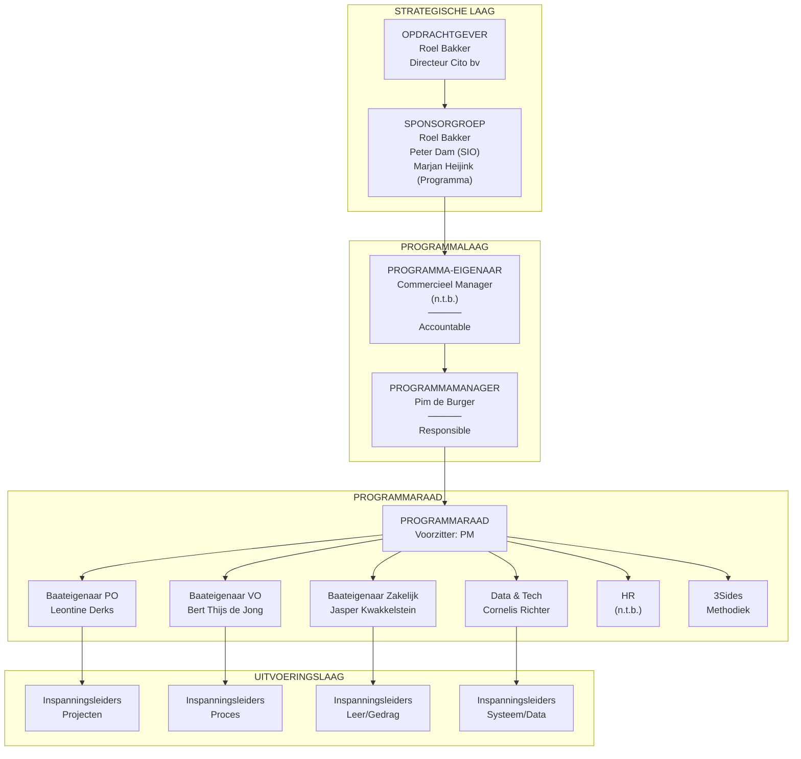
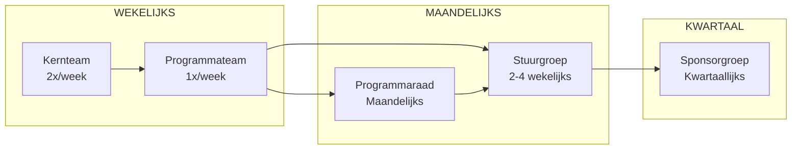
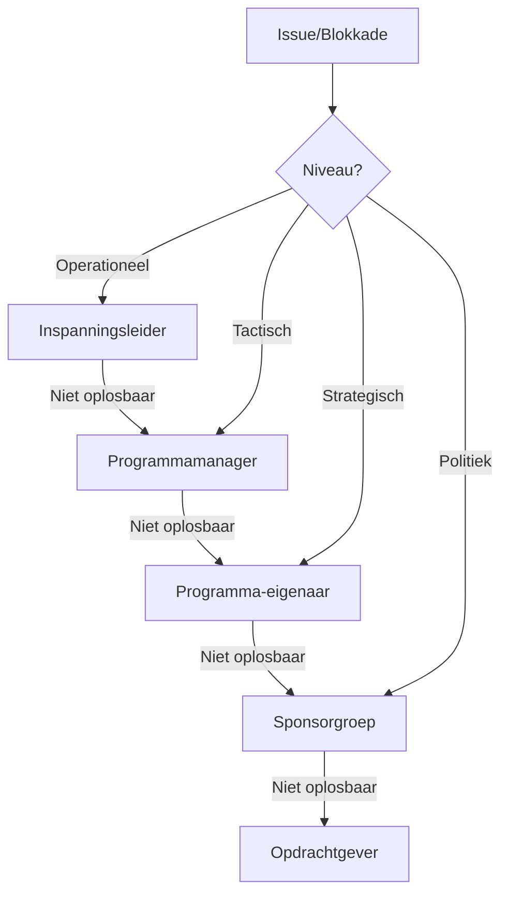

# Framework 3: Governance-schema Klant in Beeld

> **Programma:** Klant in Beeld (Cito)
> **Gegenereerd:** 10 januari 2026
> **Type:** Mermaid Org Chart + ASCII

---

## GOVERNANCE ORGANIGRAM

### Mermaid Organisatiediagram



---

## ASCII GOVERNANCE-STRUCTUUR

```
┌═══════════════════════════════════════════════════════════════════════════════════════════┐
│                              GOVERNANCE KLANT IN BEELD                                     │
└═══════════════════════════════════════════════════════════════════════════════════════════┘

                        ┌─────────────────────────────────────┐
                        │          OPDRACHTGEVER              │
                        │         Roel Bakker                 │
                        │        Directeur Cito bv            │
                        └───────────────┬─────────────────────┘
                                        │
                        ┌───────────────▼─────────────────────┐
                        │          SPONSORGROEP               │
                        ├─────────────────────────────────────┤
                        │  • Roel Bakker (Directeur)          │
                        │  • Peter Dam (Manager SIO)          │
                        │  • Marjan Heijink (Programmadir.)   │
                        └───────────────┬─────────────────────┘
                                        │
                        ┌───────────────▼─────────────────────┐
                        │        PROGRAMMA-EIGENAAR           │
                        │       Commercieel Manager           │
                        │            (n.t.b.)                 │
                        │  ─────────────────────────────────  │
                        │  ACCOUNTABLE voor batenrealisatie   │
                        └───────────────┬─────────────────────┘
                                        │
                        ┌───────────────▼─────────────────────┐
                        │        PROGRAMMAMANAGER             │
                        │         Pim de Burger               │
                        │  ─────────────────────────────────  │
                        │  RESPONSIBLE voor dagelijkse        │
                        │  leiding en samenhang               │
                        └───────────────┬─────────────────────┘
                                        │
        ┌───────────────────────────────┼───────────────────────────────┐
        │                               │                               │
        ▼                               ▼                               ▼
┌───────────────────┐       ┌───────────────────┐       ┌───────────────────┐
│  PROGRAMMARAAD    │       │  PROGRAMMABUREAU  │       │  EXTERNE PARTNER  │
│  (Adviserend)     │       │  (Ondersteunend)  │       │                   │
├───────────────────┤       ├───────────────────┤       ├───────────────────┤
│ Voorzitter: PM    │       │ Programma-        │       │ 3Sides            │
│                   │       │ ondersteuner      │       │ ─────────────     │
│ Leden:            │       │ (n.t.b.)          │       │ Methodiek         │
│ • PE              │       │                   │       │ Coaching          │
│ • Baateigenaren   │       │                   │       │ Kwaliteitsborging │
│ • D&T             │       │                   │       │                   │
│ • HR              │       │                   │       │                   │
│ • 3Sides          │       │                   │       │                   │
└───────────────────┘       └───────────────────┘       └───────────────────┘
        │
        ├───────────────┬───────────────┬───────────────┐
        ▼               ▼               ▼               ▼
┌─────────────┐ ┌─────────────┐ ┌─────────────┐ ┌─────────────┐
│BAATEIGENAAR │ │BAATEIGENAAR │ │BAATEIGENAAR │ │DATA & TECH  │
│     PO      │ │     VO      │ │  ZAKELIJK   │ │             │
├─────────────┤ ├─────────────┤ ├─────────────┤ ├─────────────┤
│ Leontine    │ │ Bert Thijs  │ │ Jasper      │ │ Cornelis    │
│ Derks       │ │ de Jong     │ │ Kwakkelstein│ │ Richter     │
└──────┬──────┘ └──────┬──────┘ └──────┬──────┘ └──────┬──────┘
       │               │               │               │
       ▼               ▼               ▼               ▼
┌─────────────────────────────────────────────────────────────┐
│                    INSPANNINGSLEIDERS                        │
├─────────────────────────────────────────────────────────────┤
│ • Projectleiders                                             │
│ • Procesleiders                                              │
│ • Leiders leer- en gedragstrajecten                          │
│ • Systeem- en datatrajectleiders                             │
│                                                              │
│ (Allemaal n.t.b. - te benoemen na GO-besluit)                │
└─────────────────────────────────────────────────────────────┘
```

---

## ROLLEN EN VERANTWOORDELIJKHEDEN

### OPDRACHTGEVER

```
┌═══════════════════════════════════════════════════════════════════════════════════════════┐
│  ROL: OPDRACHTGEVER                                                                       │
│  Persoon: Roel Bakker (Directeur Cito bv)                                                 │
├═══════════════════════════════════════════════════════════════════════════════════════════┤
│                                                                                           │
│  VERANTWOORDELIJKHEDEN                                                                    │
│  ─────────────────────                                                                    │
│  • Geven van mandaat en richting aan het programma                                        │
│  • Accorderen van doelbeeld, kaders en middelen                                           │
│  • Bewaken strategische aansluiting op koers Cito                                         │
│  • Nemen van besluiten op vooraf gedefinieerde beslismomenten                             │
│                                                                                           │
│  BESLISSINGSBEVOEGDHEID                                                                   │
│  ───────────────────────                                                                  │
│  • Go/no-go programmastart                                                                │
│  • Goedkeuring businesscase                                                               │
│  • Goedkeuring begroting                                                                  │
│  • Afbouwbesluit                                                                          │
│                                                                                           │
│  BETROKKENHEID                                                                            │
│  ──────────────                                                                           │
│  • Bij stadia-overgangen                                                                  │
│  • Bij grote oplevermomenten                                                              │
│  • Bij escalaties                                                                         │
│  • Kwartaalreviews                                                                        │
│                                                                                           │
└═══════════════════════════════════════════════════════════════════════════════════════════┘
```

### SPONSORGROEP

```
┌═══════════════════════════════════════════════════════════════════════════════════════════┐
│  ROL: SPONSORGROEP                                                                        │
│  Leden: Roel Bakker, Peter Dam (SIO), Marjan Heijink (Programma)                          │
├═══════════════════════════════════════════════════════════════════════════════════════════┤
│                                                                                           │
│  VERANTWOORDELIJKHEDEN                                                                    │
│  ─────────────────────                                                                    │
│  • Ondersteunen PM en PE bij oplossen blokkades                                           │
│  • Bewaken samenhang met andere strategische initiatieven                                 │
│  • Zorgen voor randvoorwaarden op bestuurlijk niveau                                      │
│  • Helpen bij prioriteren wanneer programmadoelen spanning geven                          │
│                                                                                           │
│  BESLISSINGSBEVOEGDHEID                                                                   │
│  ───────────────────────                                                                  │
│  • Verkenningsopdracht goedkeuren                                                         │
│  • Benoeming programma-eigenaar                                                           │
│  • Prioritering programma t.o.v. andere initiatieven                                      │
│  • Afbouwbesluit (samen met opdrachtgever)                                                │
│                                                                                           │
│  FREQUENTIE                                                                               │
│  ──────────                                                                               │
│  • Startfase: op afroep                                                                   │
│  • Uitvoering: kwartaallijks of bij escalatie                                             │
│                                                                                           │
└═══════════════════════════════════════════════════════════════════════════════════════════┘
```

### PROGRAMMA-EIGENAAR

```
┌═══════════════════════════════════════════════════════════════════════════════════════════┐
│  ROL: PROGRAMMA-EIGENAAR                                                                  │
│  Persoon: Commercieel Manager (n.t.b.)                                                    │
│  RASCI: ACCOUNTABLE                                                                       │
├═══════════════════════════════════════════════════════════════════════════════════════════┤
│                                                                                           │
│  VERANTWOORDELIJKHEDEN                                                                    │
│  ─────────────────────                                                                    │
│  • Eindverantwoordelijk voor programma en realisering visie                               │
│  • Zorgt voor middelen, strategische beslissingen, condities                              │
│  • Scharnierpunt tussen programma en lijnorganisatie                                      │
│  • Voorzitter van de stuurgroep                                                           │
│  • Legt verantwoording af aan sponsorgroep                                                │
│  • Draagt bij aan prioritering in portfolio                                               │
│                                                                                           │
│  KERNBEVOEGDHEDEN                                                                         │
│  ────────────────                                                                         │
│  • Integreert belangen en maakt afwegingen                                                │
│  • Vertegenwoordigt belang van organisatie als geheel                                     │
│  • Ziet toe dat alle belangen expliciet verdeeld zijn                                     │
│                                                                                           │
│  BESLISSINGSBEVOEGDHEID                                                                   │
│  ───────────────────────                                                                  │
│  • Goedkeuring programmaplan                                                              │
│  • Goedkeuring cyclusplannen                                                              │
│  • Toekenning middelen binnen kaders                                                      │
│  • Prioritering inspanningen                                                              │
│                                                                                           │
│  WAARSCHUWING                                                                             │
│  ───────────                                                                              │
│  Niet klaar na opdracht geven - actieve betrokkenheid nodig!                              │
│                                                                                           │
└═══════════════════════════════════════════════════════════════════════════════════════════┘
```

### PROGRAMMAMANAGER

```
┌═══════════════════════════════════════════════════════════════════════════════════════════┐
│  ROL: PROGRAMMAMANAGER                                                                    │
│  Persoon: Pim de Burger                                                                   │
│  RASCI: RESPONSIBLE                                                                       │
├═══════════════════════════════════════════════════════════════════════════════════════════┤
│                                                                                           │
│  VERANTWOORDELIJKHEDEN                                                                    │
│  ─────────────────────                                                                    │
│  • Dagelijkse leiding over het programma                                                  │
│  • Vertaalt programmatische opdracht naar werkbare structuur                              │
│  • "Spin in het web" - aanspreekpunt tussen alle betrokkenen                              │
│  • Zorgt dat samenwerking soepel verloopt                                                 │
│  • Ondersteunt bateneigenaren bij batenrealisatie                                         │
│  • Legt verantwoording af aan programma-eigenaar                                          │
│                                                                                           │
│  SPECIFIEKE TAKEN                                                                         │
│  ────────────────                                                                         │
│  • Stuurt baateigenaren en inspanningsleiders aan                                         │
│  • Bewaakt balans tussen domeinen (Mens, Proces, Systeem, Cultuur)                        │
│  • Signaleert risico's, afhankelijkheden en knelpunten                                    │
│  • Rapporteert periodiek over voortgang                                                   │
│  • Zorgt dat ervaringen worden benut in verder programmadesign                            │
│                                                                                           │
│  BESLISSINGSBEVOEGDHEID                                                                   │
│  ───────────────────────                                                                  │
│  • Opdrachten aan inspanningsleiders                                                      │
│  • Wijzigingen binnen kaders                                                              │
│  • Dagelijkse prioriteiten                                                                │
│  • Escalatie naar PE/Sponsorgroep                                                         │
│                                                                                           │
└═══════════════════════════════════════════════════════════════════════════════════════════┘
```

### BAATEIGENAREN

```
┌═══════════════════════════════════════════════════════════════════════════════════════════┐
│  ROL: BAATEIGENAREN                                                                       │
├─────────────────────┬─────────────────────┬─────────────────────┬─────────────────────────┤
│  SECTOR PO          │  SECTOR VO          │  SECTOR ZAKELIJK    │  DOMEIN                 │
│  Leontine Derks     │  Bert Thijs de Jong │  Jasper Kwakkelstein│  Data & Tech / HR       │
├─────────────────────┴─────────────────────┴─────────────────────┴─────────────────────────┤
│                                                                                           │
│  VERANTWOORDELIJKHEDEN                                                                    │
│  ─────────────────────                                                                    │
│  • Verantwoordelijk voor realisering baten binnen eigen domein/sector                     │
│  • Bepaalt samen met PM strategie en aanpak                                               │
│  • Realiseert verandering binnen eigen organisatieonderdeel                               │
│  • Kan opdrachtgever zijn voor bepaalde inspanningen                                      │
│  • Legt verantwoording af over batenrealisatie                                            │
│                                                                                           │
│  SPECIFIEKE TAKEN                                                                         │
│  ────────────────                                                                         │
│  • Definiëren van baten binnen eigen domein                                               │
│  • Initiëren van inspanningen die bijdragen aan baten                                     │
│  • Monitoren en rapporteren van voortgang                                                 │
│  • Bijdragen aan batenstructuur en prioritering in programmaraad                          │
│  • Bewaken aansluiting op programmadoelen en Cito-strategie                               │
│                                                                                           │
│  BESLISSINGSBEVOEGDHEID                                                                   │
│  ───────────────────────                                                                  │
│  • Prioritering binnen eigen domein/sector                                                │
│  • Goedkeuring inspanningsplannen binnen domein                                           │
│  • Acceptatie van opgeleverde resultaten                                                  │
│                                                                                           │
│  VERANTWOORDING                                                                           │
│  ──────────────                                                                           │
│  • Aan PM: voortgang                                                                      │
│  • Aan PE: bijdrage aan programmabaten                                                    │
│                                                                                           │
└═══════════════════════════════════════════════════════════════════════════════════════════┘
```

### INSPANNINGSLEIDERS

```
┌═══════════════════════════════════════════════════════════════════════════════════════════┐
│  ROL: INSPANNINGSLEIDERS                                                                  │
│  Status: Allemaal n.t.b. (te benoemen na GO-besluit)                                      │
├═══════════════════════════════════════════════════════════════════════════════════════════┤
│                                                                                           │
│  TYPEN                                                                                    │
│  ─────                                                                                    │
│  • Projectleiders (voor projecten)                                                        │
│  • Procesleiders (voor procesinspanningen)                                                │
│  • Leiders leer- en gedragsontwikkeltrajecten                                             │
│  • Systeem- of datatrajectleiders                                                         │
│                                                                                           │
│  VERANTWOORDELIJKHEDEN                                                                    │
│  ─────────────────────                                                                    │
│  • Uitwerken aanpak voor eigen inspanning binnen kaders                                   │
│  • Aansturen uitvoering en bewaken voortgang op tijd, kwaliteit, scope                    │
│  • Afstemmen met andere inspanningsleiders over afhankelijkheden                          │
│  • Rapporteren aan PM en relevante baateigenaar                                           │
│                                                                                           │
│  BESLISSINGSBEVOEGDHEID                                                                   │
│  ───────────────────────                                                                  │
│  • Alle besluiten voor uitvoering binnen plan                                             │
│  • Escalatie naar PM/Baateigenaar bij overschrijding kaders                               │
│                                                                                           │
└═══════════════════════════════════════════════════════════════════════════════════════════┘
```

---

## OVERLEGSTRUCTUUR

```
┌═══════════════════════════════════════════════════════════════════════════════════════════┐
│  OVERLEGSTRUCTUUR KLANT IN BEELD                                                          │
├═══════════════════════════════════════════════════════════════════════════════════════════┤
│                                                                                           │
│  OVERLEG              │ FREQUENTIE    │ DEELNEMERS           │ DOEL                       │
│  ─────────────────────┼───────────────┼──────────────────────┼────────────────────────────│
│  SPONSORGROEP         │ Kwartaallijks │ SG + PE + PM         │ Strategische aansluiting,  │
│                       │ + op afroep   │                      │ blokkades oplossen         │
│  ─────────────────────┼───────────────┼──────────────────────┼────────────────────────────│
│  STUURGROEP           │ 2-wekelijks   │ PE + PM + BE's       │ Strategische sturing,      │
│  (Start: 2-wekelijks) │ → 4-wekelijks │                      │ baten, risico's            │
│  ─────────────────────┼───────────────┼──────────────────────┼────────────────────────────│
│  PROGRAMMARAAD        │ Maandelijks   │ PM + BE's + D&T +    │ Advies prioritering,       │
│                       │               │ HR + 3Sides          │ samenhang, risico's        │
│  ─────────────────────┼───────────────┼──────────────────────┼────────────────────────────│
│  PROGRAMMATEAM        │ Wekelijks     │ PM + Inspannings-    │ Dagelijkse voortgang,      │
│                       │               │ leiders              │ afstemming                 │
│  ─────────────────────┼───────────────┼──────────────────────┼────────────────────────────│
│  KERNTEAM             │ 2x per week   │ PM + 1-2 sleutel-    │ Snelle afstemming          │
│                       │               │ rollen               │                            │
│  ─────────────────────┼───────────────┼──────────────────────┼────────────────────────────│
│  WERKGROEPEN          │ Per workstream│ Inspanningsleider +  │ Inhoudelijke voortgang     │
│                       │               │ team                 │                            │
│                                                                                           │
└═══════════════════════════════════════════════════════════════════════════════════════════┘
```

### Mermaid Overlegflow



---

## BESLUITVORMINGSSCHEMA

```
┌═══════════════════════════════════════════════════════════════════════════════════════════┐
│  BESLUITVORMINGSSCHEMA                                                                    │
├───────────────────────────────────────────────────────────────────────────────────────────┤
│                                                                                           │
│  NIVEAU              │ BESLIST OVER                                                       │
│  ────────────────────┼────────────────────────────────────────────────────────────────────│
│                      │                                                                    │
│  SPONSORGROEP        │ • Go/no-go programmastart                                          │
│                      │ • Benoeming programma-eigenaar                                     │
│                      │ • Prioritering t.o.v. andere initiatieven                          │
│                      │ • Afbouwbesluit                                                    │
│                      │                                                                    │
│  PROGRAMMA-EIGENAAR  │ • Goedkeuring programmaplan                                        │
│                      │ • Goedkeuring businesscase                                         │
│                      │ • Toekenning middelen                                              │
│                      │ • Goedkeuring cyclusplannen                                        │
│                      │ • Wijzigingen buiten kaders PM                                     │
│                      │                                                                    │
│  PROGRAMMAMANAGER    │ • Opdrachten aan inspanningsleiders                                │
│                      │ • Wijzigingen binnen kaders                                        │
│                      │ • Dagelijkse prioriteiten                                          │
│                      │ • Faseplannen opstellen                                            │
│                      │                                                                    │
│  BAATEIGENAAR        │ • Prioritering binnen domein/sector                                │
│                      │ • Goedkeuring inspanningsplannen domein                            │
│                      │ • Acceptatie opgeleverde resultaten                                │
│                      │                                                                    │
│  INSPANNINGSLEIDER   │ • Alle besluiten voor uitvoering binnen plan                       │
│                      │ • Teamsamenstelling                                                │
│                      │ • Werkwijze binnen kaders                                          │
│                      │                                                                    │
└═══════════════════════════════════════════════════════════════════════════════════════════┘
```

---

## ESCALATIEPAD



---

## RACI-MATRIX

```
┌═══════════════════════════════════════════════════════════════════════════════════════════┐
│  RACI-MATRIX KERNBESLUITEN                                                                │
├───────────────────────────────┬────────┬────────┬────────┬────────┬────────┬──────────────┤
│  BESLUIT                      │   OG   │   SG   │   PE   │   PM   │   BE   │   IL         │
├───────────────────────────────┼────────┼────────┼────────┼────────┼────────┼──────────────┤
│  Programmastart               │   A    │   R    │   C    │   C    │   I    │   I          │
│  Businesscase                 │   A    │   C    │   R    │   C    │   C    │   I          │
│  Programmaplan                │   I    │   C    │   A    │   R    │   C    │   I          │
│  Cyclusplan                   │   I    │   I    │   A    │   R    │   C    │   C          │
│  Inspanningsplan              │   I    │   I    │   I    │   A    │   R    │   R          │
│  Batenrealisatie domein       │   I    │   I    │   A    │   C    │   R    │   C          │
│  Batenrealisatie programma    │   I    │   I    │   A    │   R    │   C    │   I          │
│  Wijziging binnen kaders      │   I    │   I    │   I    │   A    │   C    │   R          │
│  Wijziging buiten kaders      │   I    │   C    │   A    │   R    │   C    │   I          │
│  Afbouwbesluit                │   A    │   R    │   C    │   C    │   C    │   I          │
├───────────────────────────────┴────────┴────────┴────────┴────────┴────────┴──────────────┤
│  Legenda: R=Responsible, A=Accountable, C=Consulted, I=Informed                           │
│  OG=Opdrachtgever, SG=Sponsorgroep, PE=Programma-eigenaar, PM=Programmamanager,           │
│  BE=Baateigenaar, IL=Inspanningsleider                                                    │
└═══════════════════════════════════════════════════════════════════════════════════════════┘
```

---

## ORGANISATIEVORM: REGIE

```
┌═══════════════════════════════════════════════════════════════════════════════════════════┐
│  GEKOZEN ORGANISATIEVORM: REGIE                                                           │
├═══════════════════════════════════════════════════════════════════════════════════════════┤
│                                                                                           │
│  INVLOED PM:    VORMGEVING ←────────────────────→ UITVOERING                              │
│                                                                                           │
│  REGIE          [████████████]                   [████████]                               │
│                 Meer op vormgeving               Minder op uitvoering                     │
│                                                                                           │
│  KENMERKEN KLANT IN BEELD                                                                 │
│  ─────────────────────────                                                                │
│  • PM sterke sturing op richting (strategie, architectuur)                                │
│  • Bateneigenaren behouden executie binnen eigen domeinen                                 │
│  • Mix van centraal en decentraal                                                         │
│  • Programmaraad als adviserend orgaan                                                    │
│                                                                                           │
│  WAAROM REGIE?                                                                            │
│  ─────────────                                                                            │
│  • Sectoroverstijgende samenhang nodig (PM stuurt richting)                               │
│  • Baateigenaren hebben eigen verantwoordelijkheid (decentraal)                           │
│  • Cultuurverandering vereist gezamenlijke aanpak                                         │
│  • Bestaande lijnorganisatie blijft functioneren                                          │
│                                                                                           │
└═══════════════════════════════════════════════════════════════════════════════════════════┘
```

---

## OPENSTAANDE BENOEMINGEN

| Rol | Persoon | Status | Actie |
|-----|---------|--------|-------|
| Programma-eigenaar | Commercieel Manager | **N.T.B.** | Benoemen door Sponsorgroep |
| HR-vertegenwoordiger | - | **N.T.B.** | Benoemen door PE/PM |
| Inspanningsleiders | - | **N.T.B.** | Benoemen na GO-besluit |
| Programmaondersteuner | - | **N.T.B.** | Benoemen door PM |

---

*Gegenereerd: 10 januari 2026*
*Framework 3 van 5 - Governance-schema*
