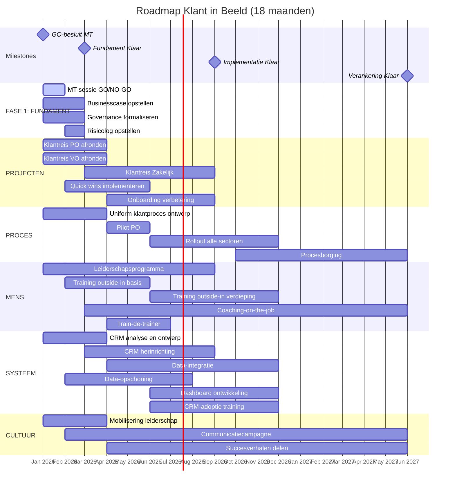

# Framework 5: Roadmap Klant in Beeld

> **Programma:** Klant in Beeld (Cito)
> **Gegenereerd:** 10 januari 2026
> **Type:** Mermaid Gantt + ASCII

---

## PROGRAMMA-ROADMAP 18 MAANDEN

### Mermaid Gantt Chart



---

## ASCII ROADMAP

```
┌═══════════════════════════════════════════════════════════════════════════════════════════┐
│  ROADMAP KLANT IN BEELD - 18 MAANDEN                                                      │
├═══════════════════════════════════════════════════════════════════════════════════════════┤
│                                                                                           │
│  MAAND:  1   2   3   4   5   6   7   8   9   10  11  12  13  14  15  16  17  18          │
│         JAN FEB MAR APR MEI JUN JUL AUG SEP OKT NOV DEC JAN FEB MAR APR MEI JUN          │
│          2026                                        2027                                 │
│                                                                                           │
│  ══════════════════════════════════════════════════════════════════════════════════════  │
│  MILESTONES                                                                               │
│  ──────────────────────────────────────────────────────────────────────────────────────  │
│         ▼                   ▼                       ▼                               ▼     │
│        [GO]            [FUNDAMENT]            [IMPLEMENTATIE]                [VERANKERING]│
│        M1                  M3                      M9                            M18      │
│                                                                                           │
│  ══════════════════════════════════════════════════════════════════════════════════════  │
│  FASE 1: FUNDAMENT (M1-M3)                                                                │
│  ──────────────────────────────────────────────────────────────────────────────────────  │
│                                                                                           │
│  MT-sessie       [███]                                                                    │
│  Businesscase    [██████]                                                                 │
│  Governance      [██████]                                                                 │
│  Risicolog           [███]                                                                │
│                                                                                           │
│  ══════════════════════════════════════════════════════════════════════════════════════  │
│  PROJECTEN                                                                                │
│  ──────────────────────────────────────────────────────────────────────────────────────  │
│                                                                                           │
│  PRJ-01 PO       [█████████]                                                              │
│  PRJ-02 VO       [█████████]                                                              │
│  PRJ-03 Zakelijk         [██████████████████]                                             │
│  PRJ-04 Quick wins   [████████████]                                                       │
│  PRJ-05 Onboarding           [███████████████]                                            │
│                                                                                           │
│  ══════════════════════════════════════════════════════════════════════════════════════  │
│  PROCESINSPANNINGEN                                                                       │
│  ──────────────────────────────────────────────────────────────────────────────────────  │
│                                                                                           │
│  PRC-01 Ontwerp  [█████████]                                                              │
│  PRC-02 Pilot                [██████]                                                     │
│  PRC-03 Rollout                      [██████████████████]                                 │
│  PRC-04 Borging                                          [████████████████████████]       │
│                                                                                           │
│  ══════════════════════════════════════════════════════════════════════════════════════  │
│  LEER- EN GEDRAGSTRAJECTEN                                                                │
│  ──────────────────────────────────────────────────────────────────────────────────────  │
│                                                                                           │
│  LRN-01 Basis        [████████████]                                                       │
│  LRN-02 Verdieping                   [██████████████████]                                 │
│  LRN-03 Leiderschap  [████████████████████████]                                           │
│  LRN-04 Coaching         [═══════════════════════════════════════════════════════]        │
│  LRN-05 Train-de-tr.         [█████████]                                                  │
│  LRN-06 Intervisie               [═══════════════════════════════════════════════]        │
│                                                                                           │
│  ══════════════════════════════════════════════════════════════════════════════════════  │
│  SYSTEEM- EN DATA-INSPANNINGEN                                                            │
│  ──────────────────────────────────────────────────────────────────────────────────────  │
│                                                                                           │
│  SYS-01 CRM Analyse  [█████████]                                                          │
│  SYS-02 CRM Build            [██████████████████]                                         │
│  SYS-03 Data-integratie          [████████████████████████]                               │
│  SYS-04 Data-opschoning  [██████████████████]                                             │
│  SYS-05 Dashboard                        [██████████████████]                             │
│  SYS-06 Adoptie                          [██████████████████]                             │
│                                                                                           │
│  ══════════════════════════════════════════════════════════════════════════════════════  │
│  CULTUUR                                                                                  │
│  ──────────────────────────────────────────────────────────────────────────────────────  │
│                                                                                           │
│  Mobilisering    [█████████]                                                              │
│  Communicatie        [═══════════════════════════════════════════════════════════]        │
│  Succesverhalen          [═══════════════════════════════════════════════════]            │
│                                                                                           │
│  Legenda: [███] = Projectmatig  [═══] = Doorlopend                                        │
│                                                                                           │
└═══════════════════════════════════════════════════════════════════════════════════════════┘
```

---

## FASEBESCHRIJVINGEN

### FASE 1: FUNDAMENT (M1-M3)

```
┌═══════════════════════════════════════════════════════════════════════════════════════════┐
│  FASE 1: FUNDAMENT                                                                        │
│  Periode: Januari - Maart 2026                                                            │
│  Mijlpaal: M3 - FUNDAMENT KLAAR                                                           │
├═══════════════════════════════════════════════════════════════════════════════════════════┤
│                                                                                           │
│  FOCUS                                                                                    │
│  ─────                                                                                    │
│  • Go/no-go besluit van MT                                                                │
│  • Formaliseren governance en rollen                                                      │
│  • Opstellen businesscase en begroting                                                    │
│  • Afronden klantreistrajecten PO en VO                                                   │
│  • Starten met CRM-analyse en procesontwerp                                               │
│  • Starten leiderschapsprogramma                                                          │
│                                                                                           │
│  DELIVERABLES                                                                             │
│  ───────────                                                                              │
│  ✓ GO-besluit MT                                                                          │
│  ✓ Businesscase goedgekeurd                                                               │
│  ✓ Programmaplan afgerond                                                                 │
│  ✓ Governance formeel vastgesteld                                                         │
│  ✓ Risicolog opgesteld                                                                    │
│  ✓ Begroting 2026 goedgekeurd                                                             │
│  ✓ Klantreis PO en VO afgerond                                                            │
│  ✓ CRM-analyse gereed                                                                     │
│  ✓ Uniform klantproces ontwerp gereed                                                     │
│                                                                                           │
│  KRITIEKE SUCCESFACTOREN                                                                  │
│  ────────────────────────                                                                 │
│  • MT-commitment (GO-besluit)                                                             │
│  • Programma-eigenaar benoemd en actief                                                   │
│  • Voldoende middelen toegekend                                                           │
│  • Leiderschap gestart met ontwikkeling                                                   │
│                                                                                           │
│  RISICO'S                                                                                 │
│  ────────                                                                                 │
│  • Vertraging GO-besluit → blokkeert alles                                                │
│  • Geen PE benoemd → geen strategische sturing                                            │
│  • Onvoldoende budget → scope moet krimpen                                                │
│                                                                                           │
└═══════════════════════════════════════════════════════════════════════════════════════════┘
```

### FASE 2: IMPLEMENTATIE (M4-M9)

```
┌═══════════════════════════════════════════════════════════════════════════════════════════┐
│  FASE 2: IMPLEMENTATIE                                                                    │
│  Periode: April - September 2026                                                          │
│  Mijlpaal: M9 - IMPLEMENTATIE KLAAR                                                       │
├═══════════════════════════════════════════════════════════════════════════════════════════┤
│                                                                                           │
│  FOCUS                                                                                    │
│  ─────                                                                                    │
│  • Pilot en rollout uniform klantproces                                                   │
│  • CRM-herinrichting en data-integratie                                                   │
│  • Training outside-in breed uitrollen                                                    │
│  • Klantreis Zakelijk uitvoeren                                                           │
│  • Onboarding verbetering implementeren                                                   │
│  • Dashboard ontwikkelen                                                                  │
│                                                                                           │
│  DELIVERABLES                                                                             │
│  ───────────                                                                              │
│  ✓ Uniform klantproces geïmplementeerd in pilot                                           │
│  ✓ Rollout naar alle sectoren gestart                                                     │
│  ✓ CRM vernieuwd en operationeel                                                          │
│  ✓ 50% medewerkers getraind outside-in                                                    │
│  ✓ Dashboard operationeel                                                                 │
│  ✓ Klantreis Zakelijk ontwerp gereed                                                      │
│  ✓ Train-de-trainer afgerond                                                              │
│  ✓ Interne trainers gecertificeerd                                                        │
│                                                                                           │
│  KRITIEKE SUCCESFACTOREN                                                                  │
│  ────────────────────────                                                                 │
│  • Pilot succesvol → bewijs voor rollout                                                  │
│  • CRM op tijd → processen kunnen werken                                                  │
│  • Trainingen effectief → gedrag verandert                                                │
│  • Leiderschap blijft betrokken                                                           │
│                                                                                           │
│  RISICO'S                                                                                 │
│  ────────                                                                                 │
│  • CRM-vertraging → processen geblokkeerd                                                 │
│  • Terugval in oud gedrag → effect training weg                                           │
│  • Zakelijk loopt achter → ongelijkmatig resultaat                                        │
│  • Capaciteitsproblemen → vertraging                                                      │
│                                                                                           │
└═══════════════════════════════════════════════════════════════════════════════════════════┘
```

### FASE 3: VERANKERING (M10-M18)

```
┌═══════════════════════════════════════════════════════════════════════════════════════════┐
│  FASE 3: VERANKERING                                                                      │
│  Periode: Oktober 2026 - Juni 2027                                                        │
│  Mijlpaal: M18 - VERANKERING KLAAR                                                        │
├═══════════════════════════════════════════════════════════════════════════════════════════┤
│                                                                                           │
│  FOCUS                                                                                    │
│  ─────                                                                                    │
│  • Borging processen in standaardwerk                                                     │
│  • Optimalisatie op basis van ervaringen                                                  │
│  • Cultuurverandering verankeren                                                          │
│  • Continue coaching en reflectie                                                         │
│  • Overdracht naar lijnorganisatie voorbereiden                                           │
│                                                                                           │
│  DELIVERABLES                                                                             │
│  ───────────                                                                              │
│  ✓ 100% uniform klantproces geïmplementeerd                                               │
│  ✓ 80% medewerkers gecertificeerd outside-in                                              │
│  ✓ 360° klantbeeld voor 85% klanten                                                       │
│  ✓ Datakwaliteit 8.5/10                                                                   │
│  ✓ Eigenaarschapsmeting 7.5/10                                                            │
│  ✓ Churn PO naar 8%                                                                       │
│  ✓ Relatieduur VO +30%                                                                    │
│  ✓ ARR Zakelijk +15%                                                                      │
│  ✓ Processen geborgd in lijnorganisatie                                                   │
│  ✓ Afbouwplan gereed                                                                      │
│                                                                                           │
│  KRITIEKE SUCCESFACTOREN                                                                  │
│  ────────────────────────                                                                 │
│  • Leiderschap houdt focus                                                                │
│  • Geen terugval na "eerste successen"                                                    │
│  • Lijnorganisatie neemt over                                                             │
│  • Baten meetbaar en gerealiseerd                                                         │
│                                                                                           │
│  RISICO'S                                                                                 │
│  ────────                                                                                 │
│  • Aandacht verslapt → terugval                                                           │
│  • Lijn niet klaar voor overname                                                          │
│  • Externe factoren verstoren → strategie wijzigt                                         │
│  • Afbouw wordt afgeraffeld                                                               │
│                                                                                           │
└═══════════════════════════════════════════════════════════════════════════════════════════┘
```

---

## MIJLPALEN EN GO/NO-GO MOMENTEN

```
┌═══════════════════════════════════════════════════════════════════════════════════════════┐
│  MIJLPALEN EN GO/NO-GO MOMENTEN                                                           │
├─────────┬───────────────────────────────────────┬─────────────────────────────────────────┤
│  MOMENT │ OMSCHRIJVING                          │ CRITERIA                                │
├─────────┼───────────────────────────────────────┼─────────────────────────────────────────┤
│  M1     │ GO-BESLUIT MT                         │ • MT akkoord met programmatische aanpak │
│  Jan 26 │ Start formele programma               │ • Programma-eigenaar benoemd            │
│         │                                       │ • Budget toegekend                      │
│         │                                       │ • Governance vastgesteld                │
├─────────┼───────────────────────────────────────┼─────────────────────────────────────────┤
│  M3     │ FUNDAMENT KLAAR                       │ • Businesscase goedgekeurd              │
│  Mrt 26 │ Einde Fase 1                          │ • Klantreis PO/VO afgerond              │
│         │                                       │ • CRM-analyse gereed                    │
│         │                                       │ • Procesontwerp gereed                  │
│         │                                       │ • Risicolog compleet                    │
├─────────┼───────────────────────────────────────┼─────────────────────────────────────────┤
│  M6     │ MID-TERM REVIEW                       │ • Pilot succesvol                       │
│  Jun 26 │ Tussentijdse evaluatie                │ • CRM operationeel                      │
│         │                                       │ • 30% getraind                          │
│         │                                       │ • Risico's onder controle               │
├─────────┼───────────────────────────────────────┼─────────────────────────────────────────┤
│  M9     │ IMPLEMENTATIE KLAAR                   │ • Rollout klantproces voltooid          │
│  Sep 26 │ Einde Fase 2                          │ • CRM volledig operationeel             │
│         │                                       │ • 50% getraind                          │
│         │                                       │ • Dashboard operationeel                │
│         │                                       │ • Klantreis Zakelijk ontwerp gereed     │
├─────────┼───────────────────────────────────────┼─────────────────────────────────────────┤
│  M12    │ JAARREVIEW                            │ • Baten op schema                       │
│  Dec 26 │ Evaluatie en planning 2027            │ • Gedragsverandering zichtbaar          │
│         │                                       │ • Cultuurmeting positief                │
│         │                                       │ • Budget 2027 aangevraagd               │
├─────────┼───────────────────────────────────────┼─────────────────────────────────────────┤
│  M18    │ VERANKERING KLAAR                     │ • Alle KPI's behaald                    │
│  Jun 27 │ Einde Fase 3                          │ • Processen geborgd in lijn             │
│         │ Start Afbouw                          │ • Gedrag verankerd                      │
│         │                                       │ • Overdracht naar lijn gestart          │
│         │                                       │ • Afbouwplan goedgekeurd                │
└─────────┴───────────────────────────────────────┴─────────────────────────────────────────┘
```

---

## KPI MEETMOMENTEN

```
┌═══════════════════════════════════════════════════════════════════════════════════════════┐
│  KPI MEETMOMENTEN                                                                         │
├─────────────────────────────────┬───────┬───────┬───────┬───────┬───────┬───────┬────────┤
│  KPI                            │ START │  M3   │  M6   │  M9   │  M12  │  M18  │ DOEL   │
├─────────────────────────────────┼───────┼───────┼───────┼───────┼───────┼───────┼────────┤
│  MENS                           │       │       │       │       │       │       │        │
│  % Getraind outside-in          │  10%  │  15%  │  30%  │  50%  │  70%  │  80%  │  80%   │
│  Gedragsobservatie score        │  n.m. │  n.m. │  6.0  │  6.5  │  7.0  │  7.5  │  7.5   │
├─────────────────────────────────┼───────┼───────┼───────┼───────┼───────┼───────┼────────┤
│  PROCES                         │       │       │       │       │       │       │        │
│  % Uniform proces geïmpl.       │   0%  │ ontw. │ pilot │  50%  │  80%  │ 100%  │ 100%   │
│  Procesnaleving                 │  50%  │  55%  │  60%  │  70%  │  80%  │  90%  │  90%   │
├─────────────────────────────────┼───────┼───────┼───────┼───────┼───────┼───────┼────────┤
│  SYSTEEM                        │       │       │       │       │       │       │        │
│  360° klantbeeld                │  30%  │  35%  │  45%  │  55%  │  70%  │  85%  │  85%   │
│  Datakwaliteit score            │  5.5  │  6.0  │  6.5  │  7.0  │  7.5  │  8.5  │  8.5   │
│  CRM-adoptie                    │  50%  │  55%  │  65%  │  75%  │  85%  │  90%  │  90%   │
├─────────────────────────────────┼───────┼───────┼───────┼───────┼───────┼───────┼────────┤
│  CULTUUR                        │       │       │       │       │       │       │        │
│  Eigenaarschap score            │  6.0  │  n.m. │  6.2  │  6.5  │  7.0  │  7.5  │  7.5   │
│  Proactieve initiatieven/kw     │  10   │  12   │  20   │  30   │  40   │  50+  │  50+   │
├─────────────────────────────────┼───────┼───────┼───────┼───────┼───────┼───────┼────────┤
│  SECTORBATEN                    │       │       │       │       │       │       │        │
│  PO Churn                       │  12%  │  12%  │  11%  │  10%  │  9%   │  8%   │   8%   │
│  VO Relatieduur                 │  3jr  │  n.m. │  +5%  │ +15%  │ +25%  │ +30%  │  +30%  │
│  Zakelijk ARR                   │ base  │  +1%  │  +3%  │  +7%  │ +10%  │ +15%  │  +15%  │
└─────────────────────────────────┴───────┴───────┴───────┴───────┴───────┴───────┴────────┘

Legenda: n.m. = niet gemeten in deze periode
```

---

## MONITORING-CADENCE

```
┌═══════════════════════════════════════════════════════════════════════════════════════════┐
│  MONITORING-CADENCE                                                                       │
├───────────────────┬───────────────────────────────────────────────────────────────────────┤
│  FREQUENTIE       │ ACTIVITEIT                                                            │
├───────────────────┼───────────────────────────────────────────────────────────────────────┤
│  WEKELIJKS        │ • Operationele issues bespreken (Programmateam)                       │
│                   │ • Status inspanningen bijwerken                                       │
│                   │ • Actielijst reviewen                                                 │
├───────────────────┼───────────────────────────────────────────────────────────────────────┤
│  MAANDELIJKS      │ • Stuurgroep: voortgang, risico's, beslissingen                       │
│                   │ • Dashboard update                                                    │
│                   │ • KPI-meting (subset)                                                 │
│                   │ • Risico-review                                                       │
├───────────────────┼───────────────────────────────────────────────────────────────────────┤
│  PER KWARTAAL     │ • Domein-reviews (Mens, Proces, Systeem, Cultuur)                     │
│                   │ • Plan-aanpassing indien nodig                                        │
│                   │ • Volledige KPI-meting                                                │
│                   │ • Sponsorgroep-update                                                 │
├───────────────────┼───────────────────────────────────────────────────────────────────────┤
│  HALFJAARLIJKS    │ • Externe review                                                      │
│                   │ • Strategie-validatie                                                 │
│                   │ • Cultuurmeting                                                       │
│                   │ • Fasewisseling-evaluatie                                             │
└───────────────────┴───────────────────────────────────────────────────────────────────────┘
```

---

## SAMENVATTING

| Fase | Periode | Focus | Mijlpaal |
|------|---------|-------|----------|
| **FUNDAMENT** | M1-M3 | GO-besluit, governance, ontwerp | M3: Fundament Klaar |
| **IMPLEMENTATIE** | M4-M9 | Bouwen, uitrollen, trainen | M9: Implementatie Klaar |
| **VERANKERING** | M10-M18 | Borgen, optimaliseren, overdragen | M18: Verankering Klaar |

**Kritieke Momenten:**
1. **M1**: GO-besluit MT - blokkerend voor alles
2. **M3**: Fundament klaar - basis voor implementatie
3. **M6**: Mid-term review - koerscheck
4. **M9**: Implementatie klaar - systemen en processen operationeel
5. **M18**: Verankering klaar - baten gerealiseerd, overdracht naar lijn

---

*Gegenereerd: 10 januari 2026*
*Framework 5 van 5 - Roadmap*
